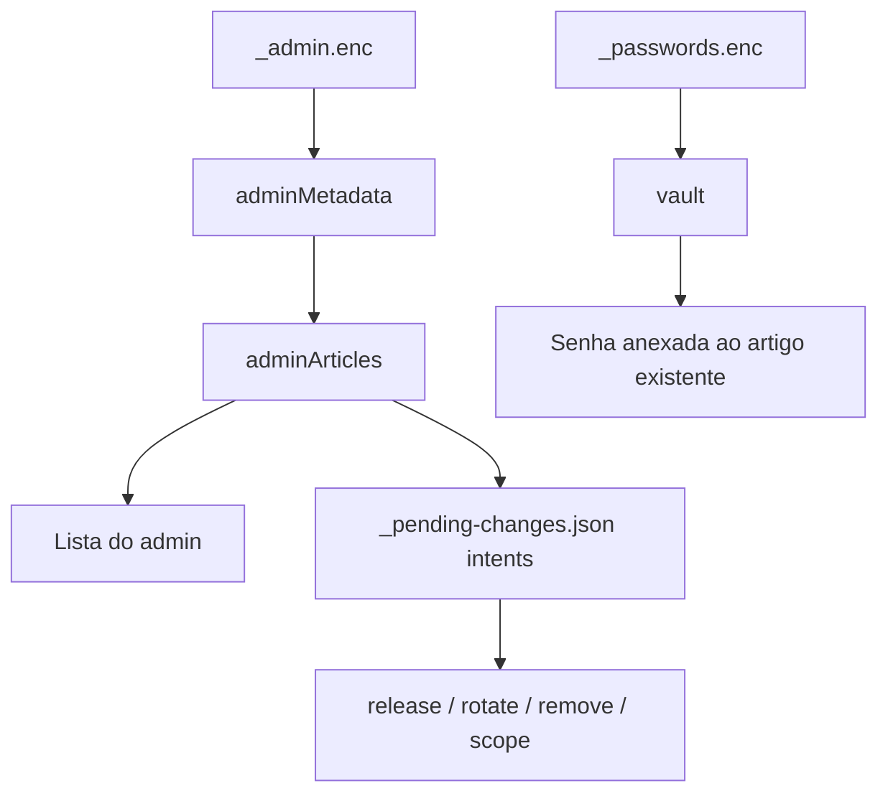

# Admin UX Lane Final Check

## Status

**PASS** - a lane de admin UX foi verificada sem alterar codigo de implementacao.

```text
CMS metadata/catalog
   |
   v
admin locked shell
   |
   v
masterpass unlock
   |
   v
article list + scoped pending actions
```



## Escopo Verificado

| Check | Status | Evidencia |
|---|---:|---|
| Admin renderiza shell seguro a partir de estado CMS/catalogo sanitizado | PASS | `/Users/felipegobbi/Documents/VibeworkV2/apps/wikia-worktrees/fix-admin-ux/publisher/artifacts-publisher-source/scripts/render-admin.py:397` valida o estado CMS, mas emite shell bloqueado sem metadata antes do unlock. |
| Lista de artigos vem do metadata admin, nao de copia hardcoded ou do cofre | PASS | `/Users/felipegobbi/Documents/VibeworkV2/apps/wikia-worktrees/fix-admin-ux/publisher/artifacts-publisher-source/templates/admin.html.tpl:82` separa `vault` de `adminMetadata`; `:164` normaliza `records/articles`; `:485` busca `_admin.enc`. |
| Artigos nao viram lista stale hardcoded | PASS | `renderList()` usa `sortedAdminArticles()` e `filteredAdminArticles()` em `/Users/felipegobbi/Documents/VibeworkV2/apps/wikia-worktrees/fix-admin-ux/publisher/artifacts-publisher-source/templates/admin.html.tpl:529`. |
| Acoes pendentes ficam escopadas por BU/projeto/artigo | PASS | `queueScopedIntent()` grava `key`, `article_id`, `bu`, `project`, `slug`, `output_url`, `current_scope` em `/Users/felipegobbi/Documents/VibeworkV2/apps/wikia-worktrees/fix-admin-ux/publisher/artifacts-publisher-source/templates/admin.html.tpl:328`. |
| Painel evita regressao visual de painel quebrado | PASS | Screenshots existentes mostram estado bloqueado, lista desbloqueada, senha revelada sob acao explicita e layout mobile sem sobreposicao incoerente. |
| Deploy | PASS | Nao executado, conforme instrucao. |

## Comandos Executados

| Comando exato | Status |
|---|---:|
| `bash publisher/artifacts-publisher-source/tests/test-admin-db.sh` | PASS |
| `bash publisher/artifacts-publisher-source/tests/test-admin-list-from-admin-metadata.sh` | PASS |
| `bash publisher/artifacts-publisher-source/tests/test-admin-no-unlock-safe-shell.sh` | PASS |
| `bash publisher/artifacts-publisher-source/tests/test-admin-scoped-pending-intents.sh` | PASS |
| `bash publisher/artifacts-publisher-source/tests/test-render-admin-cms-state.sh` | PASS |
| `bash publisher/artifacts-publisher-source/tests/test-render-admin-sidebar-wrapper.sh` | PASS |

## Evidencia Visual

Foram analisadas **4 imagens**:

| Imagem | Resultado |
|---|---|
| `/Users/felipegobbi/Documents/VibeworkV2/apps/wikia-worktrees/fix-admin-ux/.maestro/evidence/admin-ux-visual/locked-desktop.png` | PASS - shell bloqueado centralizado, sidebar sem catalogo privado e sem lista antes do unlock. |
| `/Users/felipegobbi/Documents/VibeworkV2/apps/wikia-worktrees/fix-admin-ux/.maestro/evidence/admin-ux-visual/unlocked-desktop.png` | PASS - lista de artigos, filtros, badges e painel lateral aparecem organizados. |
| `/Users/felipegobbi/Documents/VibeworkV2/apps/wikia-worktrees/fix-admin-ux/.maestro/evidence/admin-ux-visual/revealed-desktop.png` | PASS - senha so aparece no painel selecionado apos acao explicita, com botoes de operacao separados. |
| `/Users/felipegobbi/Documents/VibeworkV2/apps/wikia-worktrees/fix-admin-ux/.maestro/evidence/admin-ux-visual/unlocked-mobile.png` | PASS - layout empilha lista e painel sem colisao visual ou texto cortado de forma critica. |

## Mismatches

Nenhum mismatch encontrado.

## Observacoes

Nenhum arquivo de implementacao foi modificado nesta verificacao. A unica mudanca desta tarefa e este relatorio de evidencia e o checkbox do playbook.
