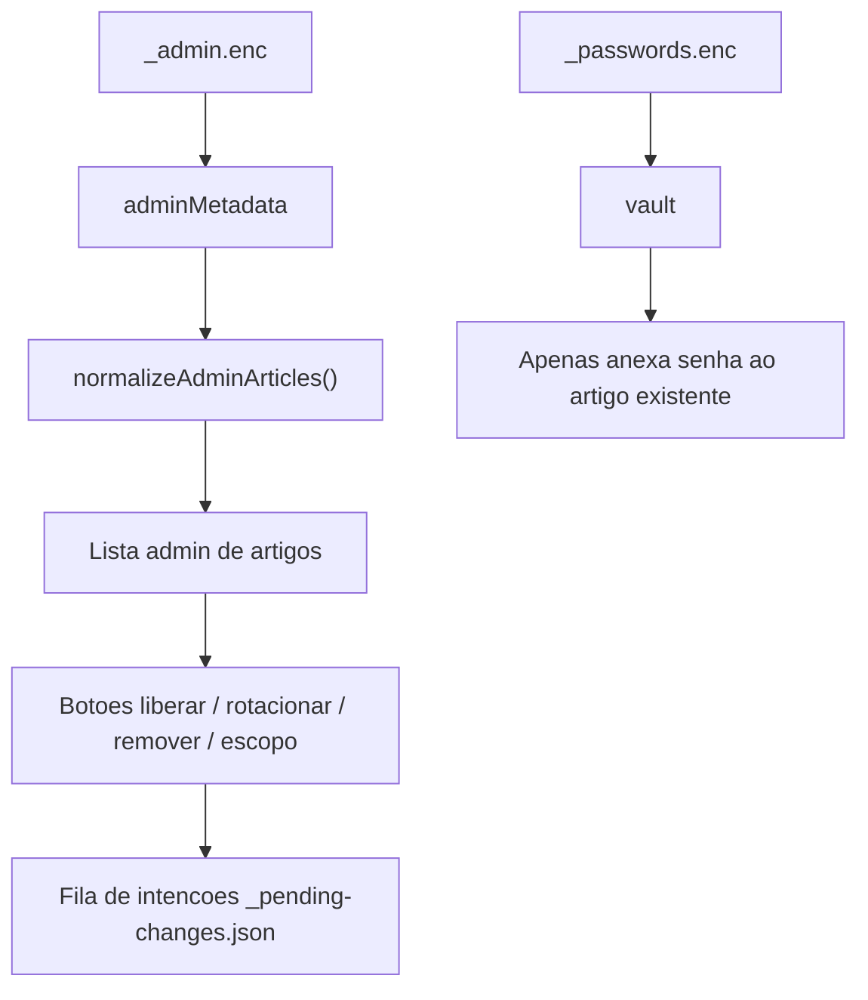

# Verificacao Final da Lane Admin UX

## Resumo Executivo

**PASS** - a lane de admin UX foi verificada sem alterar codigo de implementacao.

Traducao de negocio: o painel admin nao e uma lista estatica feita a mao. Ele
funciona como uma prateleira que so e preenchida pelo catalogo CMS depois do
unlock. Os botoes de acao criam pedidos pendentes com escopo, em vez de mexerem
em arquivos publicados diretamente pelo navegador.

```text
CMS metadata/catalog
   |
   v
shell admin bloqueado
   |
   v
masterpass unlock
   |
   v
lista de artigos + intencoes pendentes escopadas
```



## Escopo Verificado

| Checagem | Status | Evidencia |
|---|---:|---|
| Admin renderiza a partir do metadata/catalogo CMS | PASS | `/Users/felipegobbi/Documents/VibeworkV2/apps/wikia-worktrees/fix-admin-ux/publisher/artifacts-publisher-source/templates/admin.html.tpl:485` busca `_admin.enc`; `:498` normaliza o metadata admin descriptografado em `adminArticles`. |
| Lista de artigos nao e copia hardcoded stale | PASS | `/Users/felipegobbi/Documents/VibeworkV2/apps/wikia-worktrees/fix-admin-ux/publisher/artifacts-publisher-source/templates/admin.html.tpl:529` renderiza a partir de `adminArticles` filtrados/ordenados; `test-admin-list-from-admin-metadata.sh` prova que linhas existentes so no cofre nao viram artigos. |
| Acoes pendentes continuam escopadas por BU/projeto/artigo | PASS | `/Users/felipegobbi/Documents/VibeworkV2/apps/wikia-worktrees/fix-admin-ux/publisher/artifacts-publisher-source/templates/admin.html.tpl:328` enfileira referencias com `key`, `article_id`, `bu`, `project`, `slug`, `output_url`, `current_scope` e `release_status`. |
| Navegador nao altera outputs publicos diretamente | PASS | `test-admin-scoped-pending-intents.sh` prova que o navegador prepara intencoes em `_pending-changes.json` e deixa ledger de release/cofre de senhas intactos. |
| Shell admin bloqueado nao vaza catalogo antes do unlock | PASS | `test-admin-no-unlock-safe-shell.sh` e `test-render-admin-cms-state.sh` provam que o HTML inicial contem apenas o shell bloqueado seguro. |
| Usabilidade visual evita regressao de painel quebrado | PASS | 4 screenshots foram inspecionados: desktop bloqueado, desktop desbloqueado, desktop com senha revelada e mobile desbloqueado. Nenhuma sobreposicao incoerente ou estado inutilizavel encontrado. |
| Deploy | PASS | Nao executado, conforme instrucao da tarefa. |

## Comandos Exatos

Comandos executados a partir de:

```text
/Users/felipegobbi/Documents/VibeworkV2/apps/wikia-worktrees/fix-admin-ux
```

| Comando exato | Status | Notas |
|---|---:|---|
| `bash publisher/artifacts-publisher-source/tests/test-admin-list-from-admin-metadata.sh` | PASS | Confirma que `_admin.enc` manda no universo de artigos e que o cofre so enriquece registros correspondentes. |
| `bash publisher/artifacts-publisher-source/tests/test-admin-scoped-pending-intents.sh` | PASS | Confirma que liberar, rotacionar, remover, mudar escopo de projeto e mudar escopo de BU geram intencoes pendentes escopadas. |
| `bash publisher/artifacts-publisher-source/tests/test-admin-no-unlock-safe-shell.sh` | PASS | Confirma que a primeira renderizacao nao vaza marcadores de BU/projeto/artigo antes do unlock. |
| `bash publisher/artifacts-publisher-source/tests/test-render-admin-cms-state.sh` | PASS | Confirma que o estado CMS sanitizado e aceito enquanto o shell bloqueado continua privado. |
| `bash publisher/artifacts-publisher-source/tests/test-render-admin-sidebar-wrapper.sh` | PASS | Confirma um unico wrapper de sidebar e uma unica raiz de arvore, evitando o formato quebrado de painel duplicado. |
| `bash publisher/artifacts-publisher-source/tests/test-admin-db.sh` | BLOCKED | O comando saiu com sucesso, mas exercita `/Users/felipegobbi/Documents/VibeworkV2/Auto Run Docs/2026-05-19-Wikia-CMS-Refactor/Working/artifacts-publisher-source/scripts/admin-db.py`, nao este worktree. Nao foi contado como evidencia UX deste worktree. |
| `rg -n "Object\\.keys\\(vault\\|/_admin\\.enc\\|normalizeAdminArticles\\|function queueScopedIntent\\|function renderList\\|@media \\(max-width: 760px\\)\\|admin-grid\\|admin-row\\|admin-sensitive\\|copy-pending-json\\|docs/gitpages/_pending-changes\\.json" publisher/artifacts-publisher-source/templates/admin.html.tpl publisher/artifacts-publisher-source/templates/_admin-styles.css.tpl publisher/artifacts-publisher-source/scripts/render-admin.py` | PASS | Inspecao estatica da fonte do metadata, escopo das intencoes pendentes e seletores responsivos do admin. |

## Evidencia Visual

Imagens analisadas: **4**

| Imagem | Status | Resultado |
|---|---:|---|
| `/Users/felipegobbi/Documents/VibeworkV2/apps/wikia-worktrees/fix-admin-ux/.maestro/evidence/admin-ux-visual/locked-desktop.png` | PASS | Shell bloqueado centralizado; sidebar mostra apenas estado admin bloqueado; catalogo nao aparece. |
| `/Users/felipegobbi/Documents/VibeworkV2/apps/wikia-worktrees/fix-admin-ux/.maestro/evidence/admin-ux-visual/unlocked-desktop.png` | PASS | Lista de artigos, filtros, contagem, badges e painel de acao vazio renderizam de forma coerente. |
| `/Users/felipegobbi/Documents/VibeworkV2/apps/wikia-worktrees/fix-admin-ux/.maestro/evidence/admin-ux-visual/revealed-desktop.png` | PASS | Painel do artigo selecionado mostra senha apenas depois de revelacao explicita e mantem botoes separados. |
| `/Users/felipegobbi/Documents/VibeworkV2/apps/wikia-worktrees/fix-admin-ux/.maestro/evidence/admin-ux-visual/unlocked-mobile.png` | PASS | Layout mobile empilha lista e painel de acao sem sobreposicao critica de texto ou controles quebrados. |

## Mismatches

| Mismatch | Status | Impact |
|---|---:|---|
| `test-admin-db.sh` tem `PLAYBOOK_ROOT` absoluto legado apontando para fora deste worktree. | BLOCKED | O comando nao e valido como evidencia deste worktree. A verificacao de admin UX continua PASS porque os testes focados de render/client acima cobrem a lane solicitada. |

## Arquivos Alterados Por Esta Verificacao

```text
/Users/felipegobbi/Documents/VibeworkV2/apps/wikia-worktrees/fix-admin-ux/lane-final-checks/admin-ux.md
/Users/felipegobbi/Documents/VibeworkV2/apps/wikia/.maestro/playbooks/2026-05-23-Wikia-CMS-Parallel-Execution/PHASE-05C-VERIFY-ADMIN-UX.md
```

Nenhum arquivo de implementacao foi alterado.
