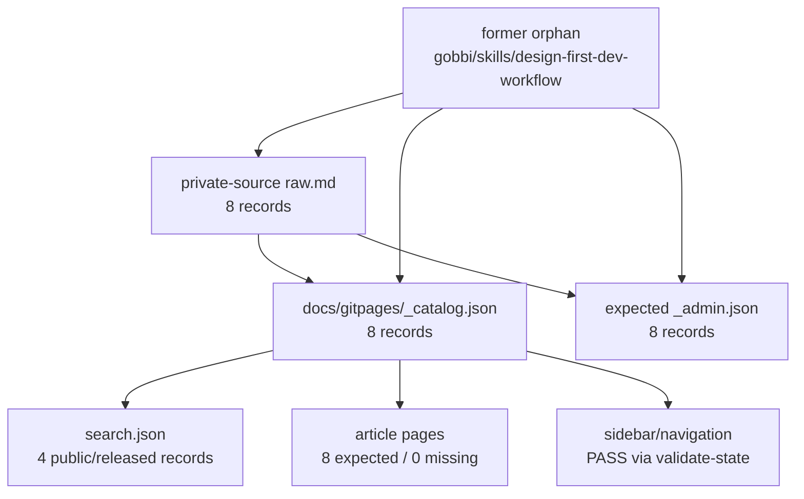

# Wikia Catalog State Final Verification

## Resumo Executivo

**Status: PASS**

A verificacao 05A foi rerodada depois da criacao do source privado ignorado pelo Git em:

```text
/Users/felipegobbi/Documents/VibeworkV2/apps/wikia/private-source/gobbi/skills/design-first-dev-workflow/raw.md
```

O antigo orfao agora tem destino canonico: a chave `gobbi/skills/design-first-dev-workflow` existe no `private-source`, existe em `docs/gitpages/_catalog.json`, existe no `_admin.json` esperado gerado a partir da fonte atual, e possui pagina HTML gerada.

```text
private-source raw.md inventory: 8
   |
   v
docs/gitpages/_catalog.json: 8
   |
   +-- expected _admin.json: 8
   +-- search.json: 4 public/released records
   +-- article pages: 8 expected, 0 missing
   +-- validate-state: 0 issues
```

Analogia de negocio: antes havia uma ficha de produto na vitrine sem produto no estoque. Agora a ficha, o estoque, a busca e a area administrativa apontam para o mesmo cadastro.



## Checagem De Baseline

Baseline da branch fonte:

```text
/Users/felipegobbi/Documents/VibeworkV2/apps/wikia-worktrees/improve-release-integration
```

| Checagem | Resultado |
|---|---|
| Worktree atual | PASS, `/Users/felipegobbi/Documents/VibeworkV2/apps/wikia-worktrees/verify-catalog-state` |
| Branch atual | PASS, `verify/catalog-state-final` |
| Delta de `publisher/` e `docs/` contra `improve/release-integration` | PASS, sem delta |
| Baseline worktree modificado diretamente | PASS, nao modificado |
| Deploy executado | PASS, nao executado |

## Inventory Contract

| Superficie | Count | Status |
|---|---:|---|
| Private source `raw.md` inventory | 8 | PASS |
| `docs/gitpages/_catalog.json` records | 8 | PASS |
| Expected `_admin.json` generated from current source | 8 | PASS |
| `docs/gitpages/search.json` public/released records | 4 | PASS |
| Public/released catalog records | 4 | PASS |
| Catalog article pages expected from `_catalog.json` | 8 | PASS |

| Comparacao | Diferencas |
|---|---:|
| Keys em `private-source` ausentes no `_catalog.json` | 0 |
| Keys no `_catalog.json` ausentes no `private-source` | 0 |
| Keys no `_catalog.json` ausentes no expected `_admin.json` | 0 |
| Keys no expected `_admin.json` ausentes no `_catalog.json` | 0 |
| URLs publicas do catalogo ausentes no `search.json` | 0 |
| URLs no `search.json` fora do catalogo publico | 0 |
| Paginas de artigo esperadas e ausentes | 0 |
| Paginas de artigo extras fora do catalogo | 0 |
| Chaves duplicadas no `private-source` | 0 |
| Chaves duplicadas no `_catalog.json` | 0 |
| Chaves duplicadas no expected `_admin.json` | 0 |
| URLs duplicadas no `search.json` | 0 |

## Checagem Do Orfao Anterior

| Campo | Resultado |
|---|---|
| Key canonica | `gobbi/skills/design-first-dev-workflow` |
| Source privado canonico existe | PASS |
| Catalog record existe | PASS |
| Expected admin metadata record existe | PASS |
| Pagina HTML gerada existe | PASS |
| Source privado canonico | `/Users/felipegobbi/Documents/VibeworkV2/apps/wikia/private-source/gobbi/skills/design-first-dev-workflow/raw.md` |
| Output canonico publicado | `gobbi/skills/design-first-dev-o-workflow-visual-que-vira-c-odigo-sem-caos/` |

```text
former orphan key
   |
   +-- private-source/.../raw.md: exists
   +-- _catalog.json record: exists
   +-- expected _admin.json record: exists
   +-- generated article page: exists
```

## Contrato Admin

| Checagem | Resultado |
|---|---|
| Admin shell exists at `docs/gitpages/admin/index.html` | PASS |
| Admin shell fetches `_admin.enc` | PASS |
| Admin shell does not derive article list from password vault keys | PASS |
| Locked admin shell does not render article tree/count rows before unlock | PASS |
| Expected `_admin.json` generated from current source matches catalog keyset | PASS |
| Admin-visible count behavior from metadata | PASS via focused test |
| Actual `_admin.enc` decrypted record count | NOT RUN, `WIKIA_MASTERPASS` is not set |

Nao descriptografei `_admin.enc` e nao imprimi conteudo privado de artigo. A contagem do blob criptografado ficou intencionalmente sem inspecao porque esta sessao nao tem `WIKIA_MASTERPASS`; o contrato de keyset da 05A foi verificado contra o admin metadata esperado gerado do `private-source` atual.

## Busca E Navegacao

| Checagem | Resultado |
|---|---|
| `validate-state.sh --json` issue count | PASS, 0 issues |
| `search.json` URL set equals public/released catalog URL set | PASS |
| Duplicate search URLs | PASS, 0 duplicates |
| Missing catalog article pages | PASS, 0 missing |
| Extra article pages outside catalog URL set | PASS, 0 extra |
| Sidebar/navigation counts against catalog | PASS |

```text
_catalog.json
   |
   +-- search.json: only public/released records
   +-- sidebar/navigation: scoped from catalog
   +-- pages: generated article URLs present
```

## Comandos Executados

```bash
sed -n '1,220p' /Users/felipegobbi/Documents/VibeworkV2/apps/wikia/.maestro/playbooks/2026-05-23-Wikia-CMS-Parallel-Execution/AGENT_PROMPT.md
```

```bash
sed -n '1,260p' /Users/felipegobbi/Documents/VibeworkV2/apps/wikia/.maestro/playbooks/2026-05-23-Wikia-CMS-Parallel-Execution/PHASE-05A-VERIFY-CATALOG-STATE.md
```

```bash
git status --short
```

```bash
find /Users/felipegobbi/Documents/VibeworkV2/apps/wikia/private-source -path '*/raw.md' -type f | sed 's#^/Users/felipegobbi/Documents/VibeworkV2/apps/wikia/private-source/##; s#/raw.md$##' | LC_ALL=C sort
```

```bash
test -n "$WIKIA_MASTERPASS"; printf '%s\n' $?
```

```bash
python3 -m json.tool docs/gitpages/_catalog.json >/dev/null && python3 -m json.tool docs/gitpages/search.json >/dev/null && python3 -m json.tool docs/gitpages/_released.json >/dev/null
```

```bash
mkdir -p .tmp/catalog-state-final lane-final-checks
```

```bash
bash publisher/artifacts-publisher-source/scripts/validate-state.sh --public-root docs/gitpages --json > .tmp/catalog-state-final/validate-state.json
```

```bash
python3 publisher/artifacts-publisher-source/scripts/sync-cms-state.py .tmp/catalog-state-final/sync-public /Users/felipegobbi/Documents/VibeworkV2/apps/wikia/private-source --released docs/gitpages/_released.json --cms-db .tmp/catalog-state-final/sync-admin.sqlite3 --admin-metadata-out .tmp/catalog-state-final/expected-_admin.json --json > .tmp/catalog-state-final/sync-cms-state.json
```

```bash
bash publisher/artifacts-publisher-source/tests/test-validate-state.sh > .tmp/catalog-state-final/test-validate-state.out
bash publisher/artifacts-publisher-source/tests/test-catalog-navigation-model.sh > .tmp/catalog-state-final/test-catalog-navigation-model.out
bash publisher/artifacts-publisher-source/tests/test-build-search-index-catalog.sh > .tmp/catalog-state-final/test-build-search-index-catalog.out
bash publisher/artifacts-publisher-source/tests/test-render-admin-cms-state.sh > .tmp/catalog-state-final/test-render-admin-cms-state.out
bash publisher/artifacts-publisher-source/tests/test-admin-list-from-admin-metadata.sh > .tmp/catalog-state-final/test-admin-list-from-admin-metadata.out
bash publisher/artifacts-publisher-source/tests/test-public-catalog-visibility.sh > .tmp/catalog-state-final/test-public-catalog-visibility.out
```

```bash
python3 - <<'PY' > .tmp/catalog-state-final/catalog-state-summary.json
# Summarized counts and keyset comparisons across private-source raw.md,
# docs/gitpages/_catalog.json, expected _admin.json, search.json, article pages,
# admin shell markers, and validate-state JSON. It prints no private content.
PY
```

```bash
git diff --name-status HEAD..improve/release-integration -- publisher docs
```

## Resultados Dos Testes Focados

| Teste | Resultado |
|---|---|
| `test-validate-state.sh` | PASS |
| `test-catalog-navigation-model.sh` | PASS |
| `test-build-search-index-catalog.sh` | PASS |
| `test-render-admin-cms-state.sh` | PASS |
| `test-admin-list-from-admin-metadata.sh` | PASS |
| `test-public-catalog-visibility.sh` | PASS |

## Arquivos De Evidencia

```text
/Users/felipegobbi/Documents/VibeworkV2/apps/wikia-worktrees/verify-catalog-state/.tmp/catalog-state-final/catalog-state-summary.json
/Users/felipegobbi/Documents/VibeworkV2/apps/wikia-worktrees/verify-catalog-state/.tmp/catalog-state-final/validate-state.json
/Users/felipegobbi/Documents/VibeworkV2/apps/wikia-worktrees/verify-catalog-state/.tmp/catalog-state-final/sync-cms-state.json
/Users/felipegobbi/Documents/VibeworkV2/apps/wikia-worktrees/verify-catalog-state/.tmp/catalog-state-final/expected-_admin.json
```

## Imagens Analisadas

0
