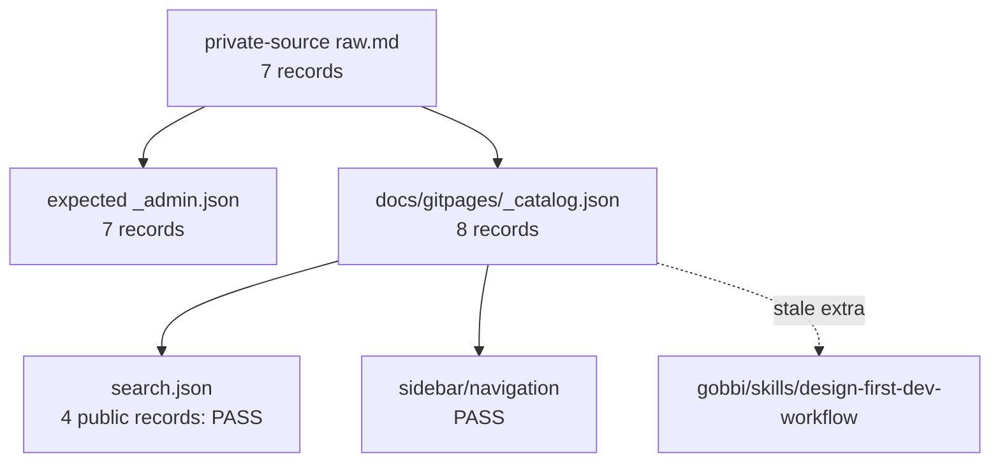

# Wikia Catalog State Final Verification

## Executive Summary

**Status: BLOCKED**

The generated public surfaces agree with the current public catalog, but the
catalog does **not** fully agree with the current private-source inventory.

```text
private-source raw.md inventory: 7
   |
   v
docs/gitpages/_catalog.json: 8
   |
   +-- search.json: PASS for public/released records only
   +-- sidebar/navigation: PASS against catalog
   +-- expected _admin.json from source: BLOCKED, only 7 source records
```

Business analogy: the storefront and search index agree with the public CRM
spreadsheet, but the CRM has one product card that no longer exists in the
warehouse source folder. That makes the final source-of-truth contract blocked.



## Baseline Check

Source branch baseline:
`/Users/felipegobbi/Documents/VibeworkV2/apps/wikia-worktrees/improve-release-integration`

| Check | Result |
|---|---|
| `publisher/` and `docs/` delta between this worktree and `improve/release-integration` | PASS, no product/output delta |
| Baseline worktree modified directly | PASS, not modified |
| Deploy attempted | PASS, not deployed |

Command:

```bash
git diff --name-status HEAD..improve/release-integration -- publisher docs > .tmp/catalog-state-final/baseline-publisher-docs.diff
```

## Inventory Contract

| Surface | Count | Status |
|---|---:|---|
| Private source `raw.md` inventory | 7 | PASS |
| `docs/gitpages/_catalog.json` records | 8 | BLOCKED |
| Expected `_admin.json` generated from current source | 7 | BLOCKED |
| `docs/gitpages/search.json` public records | 4 | PASS |
| Catalog article pages expected from `_catalog.json` | 8 | PASS |

Mismatch:

| Direction | Key |
|---|---|
| Extra in `_catalog.json`, absent from current private source inventory | `gobbi/skills/design-first-dev-workflow` |

Observed public output URL for the stale catalog record:

```text
/Users/felipegobbi/Documents/VibeworkV2/apps/wikia-worktrees/verify-catalog-state/docs/gitpages/gobbi/skills/design-first-dev-o-workflow-visual-que-vira-c-odigo-sem-caos/index.html
```

No matching source file was found at:

```text
/Users/felipegobbi/Documents/VibeworkV2/apps/wikia/private-source/gobbi/skills/design-first-dev-workflow/raw.md
```

## Admin Contract

| Check | Result |
|---|---|
| Admin shell exists at `docs/gitpages/admin/index.html` | PASS |
| Admin shell fetches `_admin.enc` | PASS |
| Admin shell does not derive article list from password vault keys | PASS |
| Locked admin shell does not render article tree/count rows before unlock | PASS |
| Expected `_admin.json` generated from current source matches catalog keyset | BLOCKED |
| Actual `_admin.enc` decrypted record count | BLOCKED, `WIKIA_MASTERPASS` is not set |

I did not decrypt or print private article contents. The blocked admin decrypt
check is intentional: without `WIKIA_MASTERPASS`, the actual encrypted metadata
blob cannot be counted safely.

## Search And Navigation

| Check | Result |
|---|---|
| `validate-state.sh --json` issue count | PASS, 0 issues |
| `search.json` URL set equals public/released catalog URL set | PASS |
| Duplicate search URLs | PASS, 0 duplicates |
| Missing catalog article pages | PASS, 0 missing |
| Extra article pages outside catalog URL set | PASS, 0 extra |
| Sidebar/navigation counts against catalog | PASS |

Important nuance: these checks prove the **public outputs agree with the public
catalog**, not that the public catalog agrees with the private source inventory.
The source inventory mismatch above is the blocker.

## Commands Run

```bash
mkdir -p .tmp/catalog-state-final lane-final-checks /Users/felipegobbi/Documents/VibeworkV2/apps/wikia/.maestro/playbooks/2026-05-23-Wikia-CMS-Parallel-Execution/Working
```

```bash
bash publisher/artifacts-publisher-source/scripts/validate-state.sh --public-root docs/gitpages --json > .tmp/catalog-state-final/validate-state.json
```

```bash
python3 publisher/artifacts-publisher-source/scripts/sync-cms-state.py .tmp/catalog-state-final/sync-public /Users/felipegobbi/Documents/VibeworkV2/apps/wikia/private-source --released docs/gitpages/_released.json --cms-db .tmp/catalog-state-final/sync-admin.sqlite3 --admin-metadata-out .tmp/catalog-state-final/expected-_admin.json --json > .tmp/catalog-state-final/sync-cms-state.json
```

```bash
bash publisher/artifacts-publisher-source/tests/test-validate-state.sh > .tmp/catalog-state-final/test-validate-state.out
bash publisher/artifacts-publisher-source/tests/test-catalog-navigation-model.sh > .tmp/catalog-state-final/test-catalog-navigation-model.out
bash publisher/artifacts-publisher-source/tests/test-build-search-index-catalog.sh > .tmp/catalog-state-final/test-build-search-index-catalog.out
bash publisher/artifacts-publisher-source/tests/test-render-admin-cms-state.sh > .tmp/catalog-state-final/test-render-admin-cms-state.out
bash publisher/artifacts-publisher-source/tests/test-admin-list-from-admin-metadata.sh > .tmp/catalog-state-final/test-admin-list-from-admin-metadata.out
bash publisher/artifacts-publisher-source/tests/test-public-catalog-visibility.sh > .tmp/catalog-state-final/test-public-catalog-visibility.out
```

```bash
python3 - <<'PY' > .tmp/catalog-state-final/catalog-state-summary.json
# Summarized counts and keyset comparisons across private-source raw.md,
# docs/gitpages/_catalog.json, expected _admin.json, search.json, article pages,
# admin shell markers, and validate-state JSON.
PY
```

## Focused Test Results

| Test | Result |
|---|---|
| `test-validate-state.sh` | PASS |
| `test-catalog-navigation-model.sh` | PASS |
| `test-build-search-index-catalog.sh` | PASS |
| `test-render-admin-cms-state.sh` | PASS |
| `test-admin-list-from-admin-metadata.sh` | PASS |
| `test-public-catalog-visibility.sh` | PASS |

## Evidence Files

```text
/Users/felipegobbi/Documents/VibeworkV2/apps/wikia-worktrees/verify-catalog-state/.tmp/catalog-state-final/catalog-state-summary.json
/Users/felipegobbi/Documents/VibeworkV2/apps/wikia-worktrees/verify-catalog-state/.tmp/catalog-state-final/validate-state.json
/Users/felipegobbi/Documents/VibeworkV2/apps/wikia-worktrees/verify-catalog-state/.tmp/catalog-state-final/sync-cms-state.json
/Users/felipegobbi/Documents/VibeworkV2/apps/wikia-worktrees/verify-catalog-state/.tmp/catalog-state-final/expected-_admin.json
```

## Images Analyzed

0
