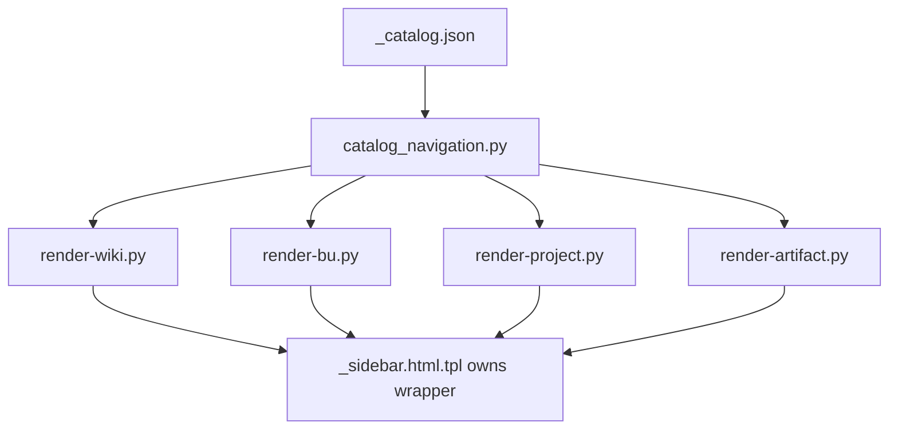

# Render Navigation Final Check

## Executive Summary

Status: PASS.

The integrated worktree confirms render/navigation behavior is catalog-driven
and does not duplicate app shell/sidebar wrappers. No implementation code was
changed for this verification.

```text
_catalog.json
   |
   v
catalog_navigation.py
   |
   +-- wiki home sidebar
   +-- BU pages
   +-- project pages
   +-- article pages
   +-- admin locked shell checks
```



## Commands Run

| Command | Status | Evidence |
|---|---:|---|
| `bash publisher/artifacts-publisher-source/tests/test-catalog-navigation-model.sh` | PASS | Verified public/article/project/BU/admin scoped navigation, BU/project public lists, article BU/project breadcrumbs, and no fallback to stale raw files when catalog filtering is empty. |
| `bash publisher/artifacts-publisher-source/tests/test-render-admin-sidebar-wrapper.sh` | PASS | Verified generated admin HTML has exactly one `<nav class="wk-sidebar-nav">` and one `<ul class="wk-tree">`; `render-wiki.py:tree_html()` returns child list items only. |
| `bash publisher/artifacts-publisher-source/tests/test-render-admin-cms-state.sh` | PASS | Verified admin accepts sanitized CMS state while initial locked HTML does not render BU/project/article nodes or count spans before unlock. |
| `bash publisher/artifacts-publisher-source/tests/test-admin-no-unlock-safe-shell.sh` | PASS | Verified locked admin shell excludes private project markers, article slugs, article labels, and sidebar counts before masterpass unlock. |
| `bash publisher/artifacts-publisher-source/tests/test-validate-state.sh` | PASS | Verified the validator catches duplicated sidebar wrappers, stale counts, legacy markers, catalog/search mismatch, plaintext private sources, and public admin-scope records. |
| `bash publisher/artifacts-publisher-source/scripts/validate-state.sh --public-root docs/gitpages --json` | PASS | Returned `{"issue_count": 0, "issues": [], "ok": true}` for `/Users/felipegobbi/Documents/VibeworkV2/apps/wikia-worktrees/improve-release-integration/docs/gitpages`. |
| `rg -n "catalog_navigation|records_for_surface|articles_from_records|build_bu_tree|artifacts_from_records" publisher/artifacts-publisher-source/scripts/render-wiki.py publisher/artifacts-publisher-source/scripts/render-bu.py publisher/artifacts-publisher-source/scripts/render-project.py publisher/artifacts-publisher-source/scripts/render-artifact.py` | PASS | Confirmed all public renderers route through `catalog_navigation.py` / shared `render-wiki.py` tree helpers instead of hardcoded page menus. |
| `python3 - <<'PY' ... wrapper count check ... PY` | PASS | Checked `21` generated HTML files: `max_sidebar_nav=1`, `max_tree_root=1`, `duplicate_shell_or_sidebar=0`. |

## Verification Results

| Requirement | Result | Notes |
|---|---:|---|
| Generated pages do not duplicate app shell/sidebar wrappers | PASS | Direct scan of `/Users/felipegobbi/Documents/VibeworkV2/apps/wikia-worktrees/improve-release-integration/docs/gitpages` found no duplicate sidebar nav, tree root, or app shell wrappers. |
| BU/project/article navigation uses catalog-derived model | PASS | `render-bu.py`, `render-project.py`, `render-artifact.py`, and `render-wiki.py` import/use `catalog_navigation.py` and shared tree helpers. |
| Adding an article flows through shared navigation model, not hardcoded menus | PASS | `test-catalog-navigation-model.sh` creates fixture catalog records and verifies new public/scoped records appear or stay hidden according to the shared catalog model across wiki, BU, project, and article surfaces. |
| Admin/search/sidebar surfaces stay aligned with catalog expectations | PASS | Focused admin tests and `validate-state.sh` passed; generated public root has zero validator issues. |

## Mismatches

None found.

## Images Analyzed

0
