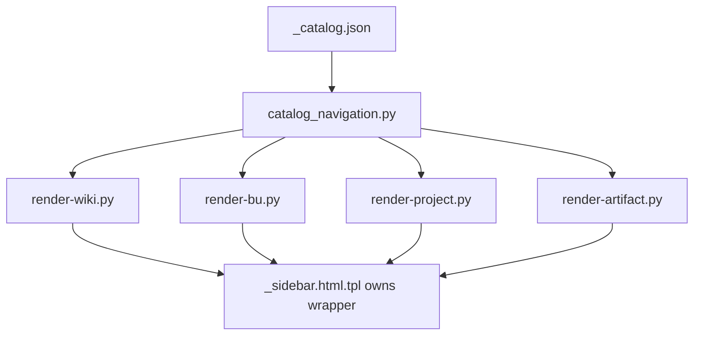

# Render Navigation Final Check

## Executive Summary

Status: PASS.

The integrated worktree confirms render/navigation behavior is catalog-driven
and does not duplicate app shell/sidebar wrappers. No implementation code was
changed for this verification.

```text
_catalog.json
   |
   v
catalog_navigation.py
   |
   +-- wiki home sidebar
   +-- BU pages
   +-- project pages
   +-- article pages
   +-- admin locked shell checks
```



## Commands Run

| Command | Status | Evidence |
|---|---:|---|
| `bash publisher/artifacts-publisher-source/tests/test-catalog-navigation-model.sh` | PASS | Verified public/article/project/BU/admin scoped navigation, BU/project public lists, article BU/project breadcrumbs, and no fallback to stale raw files when catalog filtering is empty. |
| `bash publisher/artifacts-publisher-source/tests/test-render-admin-sidebar-wrapper.sh` | PASS | Verified generated admin HTML has exactly one `<nav class="wk-sidebar-nav">` and one `<ul class="wk-tree">`; `render-wiki.py:tree_html()` returns child list items only. |
| `bash publisher/artifacts-publisher-source/tests/test-render-admin-cms-state.sh` | PASS | Verified admin accepts sanitized CMS state while initial locked HTML does not render BU/project/article nodes or count spans before unlock. |
| `bash publisher/artifacts-publisher-source/tests/test-admin-no-unlock-safe-shell.sh` | PASS | Verified locked admin shell excludes private project markers, article slugs, article labels, and sidebar counts before masterpass unlock. |
| `bash publisher/artifacts-publisher-source/tests/test-validate-state.sh` | PASS | Verified the validator catches duplicated sidebar wrappers, stale counts, legacy markers, catalog/search mismatch, plaintext private sources, and public admin-scope records. |
| `bash publisher/artifacts-publisher-source/scripts/validate-state.sh --public-root docs/gitpages --json` | PASS | Returned `{"issue_count": 0, "issues": [], "ok": true}` for `/Users/felipegobbi/Documents/VibeworkV2/apps/wikia-worktrees/improve-release-integration/docs/gitpages`. |
| `python3 - <<'PY' ... catalog/search parity check ... PY` | PASS | `_catalog.json` has `8` records, `4` released public records, and `search.json` has the same `4` public URLs. |
| `rg -n "import catalog_navigation\|load_catalog_records\|records_for_surface\|build_bu_tree\\(\|collect_bu_articles\\(\|collect_project_articles\\(\|upsert-from-raw\|Rebuilding BU home\|render-wiki\\.py\|render-bu\\.py\|render-project\\.py" publisher/artifacts-publisher-source/scripts/catalog_navigation.py publisher/artifacts-publisher-source/scripts/render-wiki.py publisher/artifacts-publisher-source/scripts/render-bu.py publisher/artifacts-publisher-source/scripts/render-project.py publisher/artifacts-publisher-source/scripts/render-artifact.py publisher/artifacts-publisher-source/scripts/publish.sh` | PASS | Confirmed publish first upserts into `_catalog.json`, then rebuilds wiki/BU/project pages through shared renderers and `catalog_navigation.py`. |
| `python3 - <<'PY' ... generated shell/sidebar count check ... PY` | PASS | Checked `21` generated HTML files: `max_wk_sidebar_nav=1`, `max_wk_tree_root=1`, `max_wk_search_modal=1`, `max_wk_drawer=1`, `duplicate_shell_or_sidebar_issues=0`. |

## Exact Multiline Checks

### Catalog/Search Parity

```bash
python3 - <<'PY'
from pathlib import Path
import json
root = Path('docs/gitpages')
catalog = json.loads((root / '_catalog.json').read_text(encoding='utf-8'))
records = catalog.get('records', [])
public_records = [r for r in records if r.get('gate_status') == 'public' and r.get('release_status') == 'released' and r.get('scope') == 'public']
search = json.loads((root / 'search.json').read_text(encoding='utf-8'))
catalog_urls = sorted((r.get('output_url') or '').strip('/') + '/' for r in public_records)
search_urls = sorted((item.get('url') or '').strip('/') + '/' for item in search)
print(f'catalog_records={len(records)}')
print(f'public_records={len(public_records)}')
print(f'search_records={len(search)}')
print('public_catalog_urls=' + ','.join(catalog_urls))
print('search_urls=' + ','.join(search_urls))
print(f'catalog_search_match={catalog_urls == search_urls}')
raise SystemExit(0 if catalog_urls == search_urls else 1)
PY
```

Output:

```text
catalog_records=8
public_records=4
search_records=4
public_catalog_urls=allin/case-cs/cs-na-case-alinhamento-eloise/,gobbi/geral/twenty-spalla-operon-crm-fit/,staging/gestao-projetos/clickup-linear-playbook/,staging/test-project/pricing-strategy-playbook/
search_urls=allin/case-cs/cs-na-case-alinhamento-eloise/,gobbi/geral/twenty-spalla-operon-crm-fit/,staging/gestao-projetos/clickup-linear-playbook/,staging/test-project/pricing-strategy-playbook/
catalog_search_match=True
```

### Generated Shell/Sidebar Count

```bash
python3 - <<'PY'
from pathlib import Path
root = Path('docs/gitpages')
html_files = sorted(root.rglob('*.html'))
checks = {
    '<nav class="wk-sidebar-nav">': 'wk_sidebar_nav',
    '<ul class="wk-tree">': 'wk_tree_root',
    'id="wk-search-modal"': 'wk_search_modal',
    'id="wk-drawer"': 'wk_drawer',
}
issues = []
max_counts = {name: 0 for name in checks.values()}
for path in html_files:
    text = path.read_text(encoding='utf-8')
    for marker, name in checks.items():
        count = text.count(marker)
        max_counts[name] = max(max_counts[name], count)
        if count > 1:
            issues.append((str(path), name, count))
print(f'html_count={len(html_files)}')
for name in sorted(max_counts):
    print(f'max_{name}={max_counts[name]}')
print(f'duplicate_shell_or_sidebar_issues={len(issues)}')
for path, name, count in issues[:20]:
    print(f'ISSUE {path} {name}={count}')
raise SystemExit(1 if issues else 0)
PY
```

Output:

```text
html_count=21
max_wk_drawer=1
max_wk_search_modal=1
max_wk_sidebar_nav=1
max_wk_tree_root=1
duplicate_shell_or_sidebar_issues=0
```

## Verification Results

| Requirement | Result | Notes |
|---|---:|---|
| Generated pages do not duplicate app shell/sidebar wrappers | PASS | Direct scan of `/Users/felipegobbi/Documents/VibeworkV2/apps/wikia-worktrees/improve-release-integration/docs/gitpages` found no duplicate sidebar nav, tree root, or app shell wrappers. |
| BU/project/article navigation uses catalog-derived model | PASS | `render-bu.py`, `render-project.py`, `render-artifact.py`, and `render-wiki.py` import/use `catalog_navigation.py` and shared tree helpers. |
| Adding an article flows through shared navigation model, not hardcoded menus | PASS | `publish.sh` upserts raw metadata into `_catalog.json`, then refreshes wiki, BU, and project pages through `render-wiki.py`, `render-bu.py`, and `render-project.py`; `test-catalog-navigation-model.sh` verifies fixture records flow through the same model across surfaces. |
| Admin/search/sidebar surfaces stay aligned with catalog expectations | PASS | Focused admin tests and `validate-state.sh` passed; generated public root has zero validator issues. |

## Mismatches

None found.

## Images Analyzed

0
