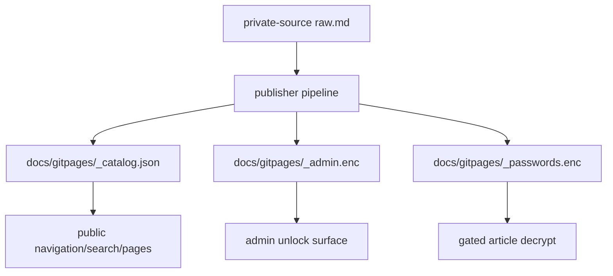

# Wikia Security Permissions Final Check

## Executive Summary

Current-worktree security and permission checks passed without printing secrets
or private article contents.

```text
vault/encryption helpers
   |
   v
public-safe catalog + encrypted admin blobs
   |
   +-- non-admin scope: article/project/BU/public only
   +-- admin surface: locked shell first, encrypted metadata after unlock
```

| Area | Status | Evidence |
| --- | --- | --- |
| Vault/encryption helpers | PASS | Required helper scripts and encrypted public artifacts exist. |
| Plaintext private source exposure | PASS | `validate-state.sh` passed on `docs/gitpages`; no `raw.md` or gate plaintext temp residue found under public output. |
| Non-admin access scoping | PASS | Focused tests and catalog checks confirm `article`, `project`, `bu`, and `public` are the only public navigation scopes; `admin` scope is rejected. |
| Admin authorized surface | PASS | Admin starts as a locked shell and unlock code fetches encrypted `_admin.enc` and `_passwords.enc`; release/rotate/remove/project-scope/BU-scope actions are present. |
| Stale external-path test harnesses | BLOCKED | Several older shell tests hardcode `/Users/felipegobbi/Documents/VibeworkV2/Auto Run Docs/2026-05-19-Wikia-CMS-Refactor`, which is outside this agent's write boundary. They were not executed. |

## Flow



## Commands And Results

| Command | Status | Notes |
| --- | --- | --- |
| `bash publisher/artifacts-publisher-source/tests/test-security-permissions.sh` | PASS | Verified gate temp cleanup, strip-gate behavior, valid BU scope, rejected `admin` scope, validator rules, and session-only gate storage. |
| `bash publisher/artifacts-publisher-source/tests/test-gate-hardening.sh` | PASS | Verified encrypted gate output, session-only storage, failure cleanup, and stale gate stripping. |
| `bash publisher/artifacts-publisher-source/tests/test-validate-state.sh` | PASS | Verified clean fixture passes and dirty public output fails for private raw markdown, plaintext temp files, admin scope, secret-like assignments, sidebar drift, and search/catalog mismatch. |
| `bash publisher/artifacts-publisher-source/tests/test-publish-apply-pending.sh` | PASS | Verified pending release/rotate/remove/scope intents, invalid `to_scope=admin` rejection, encrypted admin metadata generation, gated/public page regeneration, and no fake push/gh execution. |
| `bash publisher/artifacts-publisher-source/scripts/validate-state.sh --public-root docs/gitpages --json` | PASS | Returned `ok: true`, `issue_count: 0` for `/Users/felipegobbi/Documents/VibeworkV2/apps/wikia-worktrees/build-security-permissions/docs/gitpages`. |
| `python3 - <<'PY' ... helper/artifact/catalog plaintext-residue check ... PY` | PASS | Confirmed 7 required helper/artifact files, 8 catalog records, 0 invalid scopes, 0 forbidden catalog keys, and 0 public plaintext residue files. |
| `python3 - <<'PY' ... admin locked-shell and unlock-surface marker check ... PY` | PASS | Confirmed locked shell, search guard, `_admin.enc`/`_passwords.enc` fetch paths, admin action buttons, and no `Object.keys(vault)` article-list derivation. |

## Blocked Test Harnesses

These commands were intentionally not executed because they write temp files
under an older Auto Run root outside the allowed write boundary for this agent:

```text
/Users/felipegobbi/Documents/VibeworkV2/Auto Run Docs/2026-05-19-Wikia-CMS-Refactor
```

| Command | Status | Reason |
| --- | --- | --- |
| `bash publisher/artifacts-publisher-source/tests/test-vault-mjs.sh` | BLOCKED | Hardcoded external `PLAYBOOK_ROOT` and fixture paths. |
| `bash publisher/artifacts-publisher-source/tests/test-admin-no-unlock-safe-shell.sh` | BLOCKED | Hardcoded external `PLAYBOOK_ROOT` and temp output path. Equivalent generated-admin static checks passed in this lane. |
| `bash publisher/artifacts-publisher-source/tests/test-admin-list-from-admin-metadata.sh` | BLOCKED | Hardcoded external `PLAYBOOK_ROOT` and temp output path. Equivalent generated-admin static checks passed in this lane. |
| `bash publisher/artifacts-publisher-source/tests/test-admin-scoped-pending-intents.sh` | BLOCKED | Hardcoded external `PLAYBOOK_ROOT` and temp output path. Pending-intent behavior was covered by `test-publish-apply-pending.sh`. |
| `bash publisher/artifacts-publisher-source/tests/test-publish-private-source.sh` | BLOCKED | Hardcoded external `PLAYBOOK_ROOT` and temp output path. Plaintext private-source exposure was covered by current validation and catalog checks. |

## Evidence Details

### Vault And Encryption Helpers

Required files exist:

| Path |
| --- |
| `/Users/felipegobbi/Documents/VibeworkV2/apps/wikia-worktrees/build-security-permissions/publisher/artifacts-publisher-source/scripts/vault.mjs` |
| `/Users/felipegobbi/Documents/VibeworkV2/apps/wikia-worktrees/build-security-permissions/publisher/artifacts-publisher-source/scripts/encrypt-blob.mjs` |
| `/Users/felipegobbi/Documents/VibeworkV2/apps/wikia-worktrees/build-security-permissions/publisher/artifacts-publisher-source/scripts/encrypt.mjs` |
| `/Users/felipegobbi/Documents/VibeworkV2/apps/wikia-worktrees/build-security-permissions/publisher/artifacts-publisher-source/scripts/gate.sh` |
| `/Users/felipegobbi/Documents/VibeworkV2/apps/wikia-worktrees/build-security-permissions/publisher/artifacts-publisher-source/scripts/strip-gate.py` |
| `/Users/felipegobbi/Documents/VibeworkV2/apps/wikia-worktrees/build-security-permissions/docs/gitpages/_passwords.enc` |
| `/Users/felipegobbi/Documents/VibeworkV2/apps/wikia-worktrees/build-security-permissions/docs/gitpages/_admin.enc` |

### Plaintext Exposure

No private raw markdown or plaintext gate temp residue was found under:

```text
/Users/felipegobbi/Documents/VibeworkV2/apps/wikia-worktrees/build-security-permissions/docs/gitpages
```

The generated public catalog had:

| Metric | Value |
| --- | ---: |
| Records | 8 |
| Invalid public navigation scopes | 0 |
| Forbidden plaintext-bearing keys | 0 |
| Public plaintext residue files | 0 |

### Permission Scope

Non-admin navigation is limited to the declared public-safe surface:

| Scope | Meaning |
| --- | --- |
| `article` | The unlocked article only. |
| `project` | Same BU and same project. |
| `bu` | Same BU. |
| `public` | Public/released records only. |

`admin` is not an allowed article navigation scope in public artifacts or
pending scope intents.

### Admin Surface

The generated admin page confirms this pattern:

```text
/admin/
   |
   v
locked shell only
   |
   v
masterpass unlock in browser memory
   |
   +-- fetch encrypted _admin.enc
   +-- fetch encrypted _passwords.enc
   +-- render authorized admin actions
```

The check confirmed:

| Admin Contract | Status |
| --- | --- |
| Locked shell present before unlock | PASS |
| Search loading guarded while locked | PASS |
| `_admin.enc` fetch path present | PASS |
| `_passwords.enc` fetch path present | PASS |
| Admin list is not derived from vault-only keys | PASS |
| Release action available after unlock | PASS |
| Rotate action available after unlock | PASS |
| Remove action available after unlock | PASS |
| Project scope action available after unlock | PASS |
| BU scope action available after unlock | PASS |

## Mismatches

| Mismatch | Impact | Recommendation |
| --- | --- | --- |
| Some security/admin tests still point at an old Auto Run folder instead of resolving from the current test directory. | They cannot be safely executed by this agent because they would write outside `/Users/felipegobbi/Documents/VibeworkV2/apps/wikia-worktrees/build-security-permissions` or `/Users/felipegobbi/Documents/VibeworkV2/apps/wikia/.maestro/playbooks/2026-05-23-Wikia-CMS-Parallel-Execution`. | In a follow-up lane, refactor those tests to compute `SOURCE_ROOT` from their own location, matching the current self-contained tests. |

## Images Analyzed

0
