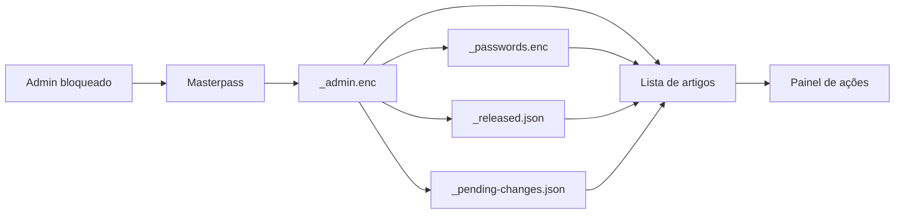

# Admin UX Discovery

## Executive Summary

O admin atual tem uma boa base de CMS: ele usa `_admin.enc` como universo de artigos e trata `_passwords.enc` só como cofre de senhas. O maior risco visual está depois do unlock: cada linha tenta ser lista, tabela, cofre e painel de ações ao mesmo tempo.

```text
masterpass
   |
   v
_admin.enc --------> lista de artigos
   |
   +--> _passwords.enc --------> senhas anexadas
   |
   +--> _released.json --------> status liberado
   |
   +--> _pending-changes.json -> intenções pendentes
```



## Arquivos Inspecionados

| Área | Caminho completo | O que controla |
|---|---|---|
| Template admin | `/Users/felipegobbi/Documents/VibeworkV2/apps/wikia-worktrees/fix-admin-ux/publisher/artifacts-publisher-source/templates/admin.html.tpl` | Estrutura, unlock, lista, painel de ações e fila pendente |
| Decrypt admin | `/Users/felipegobbi/Documents/VibeworkV2/apps/wikia-worktrees/fix-admin-ux/publisher/artifacts-publisher-source/templates/admin-decrypt.js` | Decifragem WebCrypto AES-GCM/PBKDF2 |
| CSS admin | `/Users/felipegobbi/Documents/VibeworkV2/apps/wikia-worktrees/fix-admin-ux/publisher/artifacts-publisher-source/templates/_admin-styles.css.tpl` | Layout bloqueado/desbloqueado, lista, botões, toast e mobile |
| App shell relacionado | `/Users/felipegobbi/Documents/VibeworkV2/apps/wikia-worktrees/fix-admin-ux/publisher/artifacts-publisher-source/templates/_appshell.html.tpl` | Sidebar, busca global e drawer compartilhado |
| Sidebar relacionada | `/Users/felipegobbi/Documents/VibeworkV2/apps/wikia-worktrees/fix-admin-ux/publisher/artifacts-publisher-source/templates/_sidebar.html.tpl` | Árvore e recentes renderizados pelo catálogo |

## Riscos Visuais

| Prioridade | Risco | Onde aparece | Por que importa |
|---|---|---|---|
| Alta | Linha de artigo sobrecarregada | `admin.html.tpl` renderiza título, badges, senha, copiar, revelar e três ações por linha | Em marketing, é como colocar CTA, preço, prova social e formulário no mesmo botão: o usuário não sabe onde olhar primeiro |
| Alta | Senha aparece em texto puro no painel lateral ao selecionar artigo | `selectArticle()` escreve a senha direto em `.admin-actions-pwd code` | Facilita vazamento em screenshot, call ou gravação de tela |
| Alta | Estado pendente e estado liberado usam a mesma classe visual | `.admin-row-released` serve para `liberado` e `pendente` | Status diferentes parecem a mesma coisa; decisão operacional fica ambígua |
| Média | Mobile vira uma pilha alta de botões | `.admin-row` muda para uma coluna em `max-width: 760px` e `.btn` vira `flex: 1 1 auto` | Em celular, o artigo deixa de parecer uma lista escaneável e vira um bloco grande por item |
| Média | Unlock tem texto técnico e tom arriscado | Card fala `aes-256-gcm`, `pbkdf2 100k` e "derruba o gate" | Para operação, o texto parece mais ferramenta interna de engenharia do que painel confiável |
| Média | Busca global só reativa depois do unlock, mas o botão fica visualmente pouco explicado | `_appshell.html.tpl` coloca `aria-disabled` e title | Parece quebrado para quem não percebe que o admin está bloqueado |
| Média | Script de commit dentro do browser usa `/tmp/wikia-clone` | `renderPendingPanel()` monta copy-paste script | A UI passa uma ação operacional perigosa como texto copiável, sem contexto visual de ambiente |
| Baixa | Ícones misturam emoji e símbolo solto | Botões usam olho, macaquinho e `⎘` | Visual fica inconsistente com o resto do CMS e depende de fonte/sistema |

## Propostas Para A Próxima Execução

### 1. Separar lista e ações

Transformar a lista em inventário escaneável. A linha deveria mostrar só:

```text
[título do artigo] [status]
BU / projeto / escopo
```

As ações críticas devem ficar no painel lateral depois da seleção.

### 2. Tratar senha como dado sensível

No painel lateral, manter a senha mascarada por padrão e exigir clique em "mostrar". A lista pode manter apenas o status: `senha vinculada` ou `sem senha`.

### 3. Criar badges diferentes

Usar classes separadas para:

| Status | Sugestão visual |
|---|---|
| Liberado | Badge neutro/positivo |
| Pendente | Badge de atenção |
| Sem senha | Badge de risco |
| Removido | Badge destrutivo |

### 4. Adicionar filtros operacionais

Adicionar filtros client-side depois do unlock:

```text
Todos | Liberados | Pendentes | Sem senha | Por BU/projeto
```

Isso aproveita `adminArticles`, `released`, `pending` e o cofre já carregados em memória.

### 5. Melhorar os estados do unlock

Separar mensagens de erro:

| Situação | Mensagem recomendada |
|---|---|
| Masterpass vazia | "Digite a masterpass." |
| `_admin.enc` inválido | "Não foi possível abrir o catálogo admin." |
| `_passwords.enc` indisponível | "Catálogo aberto, mas senhas indisponíveis." |

### 6. Remover hardcode operacional da experiência visual

O painel de `_pending-changes.json` pode continuar mostrando o JSON, mas o script com `/tmp/wikia-clone` deveria virar uma instrução contextual ou fluxo separado. Isso reduz risco de copiar um comando para o lugar errado.

## Checks De Screenshot Necessários

| Check | Viewport | Estado | O que validar |
|---|---:|---|---|
| Locked desktop | `1440x900` | Antes do unlock | Card centralizado, sidebar/topbar sem metadata privada, busca global visualmente desabilitada |
| Locked mobile | `390x844` | Antes do unlock | Card cabe sem corte, input e botão não estouram largura |
| Erro de masterpass | `1440x900` | Submit vazio/incorreto | Mensagem aparece sem deslocar layout de forma brusca |
| Unlocked desktop | `1440x900` | Após unlock com artigos | Lista escaneável, painel lateral sticky, badges distinguíveis |
| Unlocked tablet | `900x1024` | Após unlock | Grid vira uma coluna sem perder hierarquia |
| Unlocked mobile | `390x844` | Após unlock | Linhas não ficam gigantes, botões não esmagam texto |
| Artigo sem senha | `1440x900` | Após unlock | Estado `sem senha` aparece sem botão copiável ativo |
| Fila pendente | `1440x900` | Depois de release/rotate/scope/remove | Badge pendente e textarea não quebram a página |
| Busca após unlock | `1440x900` | Depois do unlock | Botão deixa de parecer bloqueado e modal abre com resultados |

## Decisão Da Lane

Esta rodada foi somente descoberta. Nenhum arquivo de implementação foi alterado.

```text
descoberta concluída
   |
   v
próxima lane pode implementar UX
   |
   v
validar por screenshots antes de merge
```

## Evidência

- Imagens analisadas: 0.
- Implementação alterada: não.
- Relatório criado em `/Users/felipegobbi/Documents/VibeworkV2/apps/wikia-worktrees/fix-admin-ux/lane-notes/admin-ux.md`.
