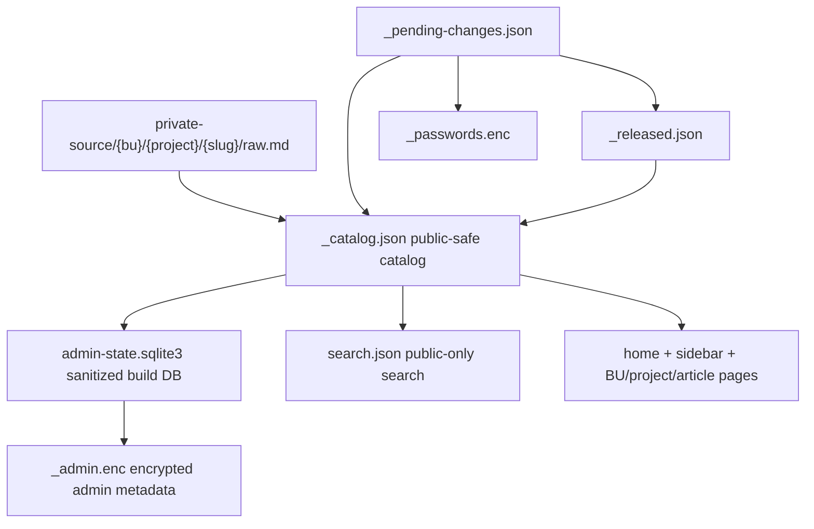

# Wikia Catalog State Discovery

## Executive Summary

Wikia ja tem um bom esqueleto de CMS: o catalogo publico em `/Users/felipegobbi/Documents/VibeworkV2/apps/wikia-worktrees/build-catalog-state/docs/gitpages/_catalog.json` e o "cadastro central" que alimenta busca, sidebar, paginas de BU/projeto/artigo e parte do admin.

Analogia de negocio: pense no `_catalog.json` como o CRM principal. Search, home, sidebar e admin deveriam ler esse CRM, nao manter listas paralelas.

```text
private raw.md
   |
   v
sync/public_catalog
   |
   +-- /Users/felipegobbi/Documents/VibeworkV2/apps/wikia-worktrees/build-catalog-state/docs/gitpages/_catalog.json
   +-- sanitized admin SQLite
   +-- encrypted admin metadata
   +-- /Users/felipegobbi/Documents/VibeworkV2/apps/wikia-worktrees/build-catalog-state/docs/gitpages/search.json
```



## Files Inspected

| Area | File |
|---|---|
| Public catalog contract | `/Users/felipegobbi/Documents/VibeworkV2/apps/wikia-worktrees/build-catalog-state/publisher/artifacts-publisher-source/scripts/public_catalog.py` |
| CMS state sync | `/Users/felipegobbi/Documents/VibeworkV2/apps/wikia-worktrees/build-catalog-state/publisher/artifacts-publisher-source/scripts/sync-cms-state.py` |
| Admin SQLite state | `/Users/felipegobbi/Documents/VibeworkV2/apps/wikia-worktrees/build-catalog-state/publisher/artifacts-publisher-source/scripts/admin-db.py` |
| Search index | `/Users/felipegobbi/Documents/VibeworkV2/apps/wikia-worktrees/build-catalog-state/publisher/artifacts-publisher-source/scripts/build-search-index.py` |
| Admin renderer | `/Users/felipegobbi/Documents/VibeworkV2/apps/wikia-worktrees/build-catalog-state/publisher/artifacts-publisher-source/scripts/render-admin.py` |
| Wiki/sidebar renderers | `/Users/felipegobbi/Documents/VibeworkV2/apps/wikia-worktrees/build-catalog-state/publisher/artifacts-publisher-source/scripts/render-wiki.py`, `/Users/felipegobbi/Documents/VibeworkV2/apps/wikia-worktrees/build-catalog-state/publisher/artifacts-publisher-source/scripts/render-bu.py`, `/Users/felipegobbi/Documents/VibeworkV2/apps/wikia-worktrees/build-catalog-state/publisher/artifacts-publisher-source/scripts/render-project.py`, `/Users/felipegobbi/Documents/VibeworkV2/apps/wikia-worktrees/build-catalog-state/publisher/artifacts-publisher-source/scripts/render-artifact.py` |
| Pending admin intents | `/Users/felipegobbi/Documents/VibeworkV2/apps/wikia-worktrees/build-catalog-state/publisher/artifacts-publisher-source/scripts/apply-pending.py` |
| State validator | `/Users/felipegobbi/Documents/VibeworkV2/apps/wikia-worktrees/build-catalog-state/publisher/artifacts-publisher-source/scripts/validate-state.sh` |
| Publish orchestrator | `/Users/felipegobbi/Documents/VibeworkV2/apps/wikia-worktrees/build-catalog-state/publisher/artifacts-publisher-source/scripts/publish.sh` |

## Ownership Map

| Owner surface | Current responsibility | Business analogy |
|---|---|---|
| `public_catalog.py` | Canonical IDs, routes, visibility fields, public-safe title, scope filters, catalog upsert/load/write. | CRM field definitions and audience segments. |
| `sync-cms-state.py` | Rebuilds `_catalog.json`, sanitized SQLite DB, and encrypted-admin plaintext input from raw sources and release ledgers. | Nightly ETL that aligns CRM, BI table, and sales dashboard source. |
| `admin-db.py` | Defines sanitized SQLite schema for build/admin workflows. It rejects obvious body/password/private-title columns. | Internal ops database with only metadata, not campaign copy or credentials. |
| `build-search-index.py` | Builds public-only search. If `_catalog.json` exists, it uses catalog records instead of walking raw markdown. | Public website search reading approved product listings only. |
| `render-wiki.py`, `render-bu.py`, `render-project.py`, `render-artifact.py` | Consume catalog for sidebars, home feed, BU pages, project pages, and article scoped navigation. | Website pages reading the same CRM segments. |
| `render-admin.py` | Validates sanitized state, but initial locked admin HTML does not emit article rows before unlock. | Admin screen loads empty shell until authorized user opens the safe. |
| `apply-pending.py` | Turns admin queue intents into release ledger, vault updates, removals, scope updates, and catalog state. | Back-office approval queue updating CRM status fields. |
| `validate-state.sh` | Checks generated public output for privacy leaks and catalog/search/sidebar drift. | QA checklist before publishing a campaign. |

## Current Generated State

| Metric | Value |
|---|---:|
| Catalog records in `/Users/felipegobbi/Documents/VibeworkV2/apps/wikia-worktrees/build-catalog-state/docs/gitpages/_catalog.json` | 8 |
| Public/released records | 4 |
| Gated/unreleased records | 4 |
| Search items in `/Users/felipegobbi/Documents/VibeworkV2/apps/wikia-worktrees/build-catalog-state/docs/gitpages/search.json` | 4 |
| Catalog/search URL drift | 0 missing, 0 extra |
| Images analyzed for this task | 0 |

## Key Findings

### What Is Working

| Finding | Evidence |
|---|---|
| Search is catalog-first when `_catalog.json` exists. | `build-search-index.py` calls `public_catalog.load_records_from_public_root()` and includes only `public_catalog.is_public_record()` records. |
| Sidebar/page surfaces are mostly catalog-first. | `render-wiki.py`, `render-bu.py`, `render-project.py`, and `render-artifact.py` all load records from public root before falling back to raw-file walking. |
| Admin initial paint is intentionally locked. | `render-admin.py` validates state but renders `admin_locked_tree_html()` and avoids article metadata in static admin HTML. |
| Admin DB schema is privacy-oriented. | `admin-db.py` blocks obvious forbidden schema terms like password, secret, body, content, markdown, and private title fields. |
| Apply-pending uses scoped identities, not bare labels only. | `apply-pending.py` matches intents by canonical key, slug, output URL, or article ID. |
| Current generated output passes validator. | `validate-state.sh --public-root ... --json` returned `ok: true` and `issue_count: 0`. |

### Risks

| Risk | Why it matters | Suggested severity |
|---|---|---|
| `sync-cms-state.py` writes `_catalog.json` before admin DB/admin metadata are fully written. | If a later admin DB upsert fails, the public catalog may already be changed. That is like updating the website CRM but failing halfway through the finance export. | High |
| State rules are duplicated in `public_catalog.py` and `validate-state.sh`. | `is_public_record()` and `scoped_records()` exist in both places. Any drift can make validation approve a page that runtime would not render, or vice versa. | High |
| Single-article publish updates catalog/search/pages but does not rebuild encrypted admin metadata. | New or changed article records can appear on public surfaces while admin `_admin.enc` waits for rebuild-all/apply-pending. | Medium |
| Existing shell tests hard-code old Auto Run paths under `/Users/felipegobbi/Documents/VibeworkV2/Auto Run Docs/2026-05-19-Wikia-CMS-Refactor`. | Tests are hard to run from this worktree as-is. This slows future lanes and can hide regressions. | Medium |
| `_released.json` can be empty while `_catalog.json` has released records. | The current generated state has 4 released catalog records and an empty released ledger. Release status is partly inferred from raw gate state, not just the ledger. | Medium |
| Public search snippets are empty when catalog exists. | This is privacy-safe, but weak for UX. Adding snippets later must happen through sanitized public fields, not raw markdown scraping. | Low |
| `public_catalog.is_public_record()` does not explicitly exclude `release_status == "removed"`. | Current removed records are set gated/article, so they stay hidden. But a malformed removed/public record could leak into public consumers. | Medium |
| Some BU/theme constants and tree helpers are repeated across renderers. | Not a blocker, but repeated routing/display rules increase maintenance cost. | Low |

## Proposed Changes

| Priority | Change | Expected result |
|---|---|---|
| 1 | Make `sync-cms-state.py` atomic: validate every record first, write DB/catalog/admin metadata to temp paths, then rename into place only after all outputs pass. | No half-updated catalog/admin state. |
| 2 | Move visibility/scope validation to `public_catalog.py` and have `validate-state.sh` import or mirror from one generated source of truth. | Runtime and QA use the same rulebook. |
| 3 | Add `public_catalog.validate_record()` for kebab fields, enums, removed-state invariants, title visibility, output URL shape, tags, and raw hash format. | Bad records fail before files are written. |
| 4 | Decide the admin freshness rule for single-article publish: either rebuild `_admin.enc` on every publish or document/enforce "admin refresh requires rebuild-all". | Predictable admin behavior. |
| 5 | Parameterize shell tests with `SOURCE_ROOT="${SOURCE_ROOT:-...}"` and `TMP_PARENT="${TMP_PARENT:-...}"`. | Tests run in any worktree without old playbook paths. |
| 6 | Add a sanitized optional `summary_public` or `snippet_public` field if search snippets matter. | Better search without reading private markdown. |
| 7 | Add an explicit removed guard to `public_catalog.is_public_record()`. | Malformed removed records stay out of public surfaces. |

## Focused Tests To Run Later

| Test | Purpose | Suggested command after test-path cleanup |
|---|---|---|
| Atomic sync failure fixture | Prove invalid raw/tags cannot leave `_catalog.json` updated while DB/admin metadata fail. | `bash /Users/felipegobbi/Documents/VibeworkV2/apps/wikia-worktrees/build-catalog-state/publisher/artifacts-publisher-source/tests/test-sync-cms-state-atomic.sh` |
| Shared visibility rules | Prove public, gated, scoped, admin, and removed records render/validate identically. | `bash /Users/felipegobbi/Documents/VibeworkV2/apps/wikia-worktrees/build-catalog-state/publisher/artifacts-publisher-source/tests/test-public-catalog-visibility.sh` |
| Search/catalog contract | Prove `search.json` contains exactly public catalog URLs and never gated/removed URLs. | `bash /Users/felipegobbi/Documents/VibeworkV2/apps/wikia-worktrees/build-catalog-state/publisher/artifacts-publisher-source/tests/test-build-search-index-catalog.sh` |
| Apply-pending round trip | Prove release, rotate, remove, and scope intents survive sync and rebuild. | `bash /Users/felipegobbi/Documents/VibeworkV2/apps/wikia-worktrees/build-catalog-state/publisher/artifacts-publisher-source/tests/test-publish-apply-pending.sh` |
| Admin metadata freshness | Prove single publish either refreshes `_admin.enc` or intentionally reports admin refresh pending. | New test recommended. |
| Validator portability | Prove all existing tests run from this worktree without the old `/Users/felipegobbi/Documents/VibeworkV2/Auto Run Docs/2026-05-19-Wikia-CMS-Refactor` path. | New harness cleanup recommended. |

## Verification Performed In This Discovery

| Check | Result |
|---|---|
| `bash /Users/felipegobbi/Documents/VibeworkV2/apps/wikia-worktrees/build-catalog-state/publisher/artifacts-publisher-source/scripts/validate-state.sh --public-root /Users/felipegobbi/Documents/VibeworkV2/apps/wikia-worktrees/build-catalog-state/docs/gitpages --json` | PASS, `ok: true`, `issue_count: 0` |
| `python3 /Users/felipegobbi/Documents/VibeworkV2/apps/wikia-worktrees/build-catalog-state/publisher/artifacts-publisher-source/scripts/admin-db.py schema --json` | PASS, schema version 1 |
| Python AST parse for catalog-state scripts | PASS for `admin-db.py`, `sync-cms-state.py`, `public_catalog.py`, and `build-search-index.py` |

## Boundaries Honored

| Boundary | Status |
|---|---|
| Implementation code edited | No |
| Generated HTML edited as source of truth | No |
| Private plaintext sources committed | No |
| Other lane worktrees touched | No |
| Images analyzed | 0 |
