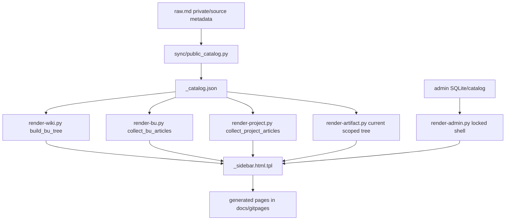

# Render Navigation Lane Discovery

## Executive Summary

The render/navigation lane should own the shared sidebar contract, the catalog-driven tree renderer, and page-shell injection consistency across wiki home, BU home, project home, article pages, and the locked admin shell. The safest next change is not to invent a second navigation source; it is to consolidate existing renderer behavior around the public catalog helper and the shared `_sidebar.html.tpl` wrapper.

```text
private raw.md / admin state
   |
   v
public-safe _catalog.json
   |
   +-- render-wiki.py tree_html()
   +-- render-bu.py sidebar/home lists
   +-- render-project.py sidebar/home lists
   +-- render-artifact.py scoped article sidebar
   +-- render-admin.py locked safe shell
   |
   v
_sidebar.html.tpl + _appshell.html.tpl
```

## Ownership

| Area | Primary Files | Current Responsibility |
|---|---|---|
| Catalog contract | `/Users/felipegobbi/Documents/VibeworkV2/apps/wikia-worktrees/build-render-navigation/publisher/artifacts-publisher-source/scripts/public_catalog.py` | Defines public-safe records, title masking, visibility rules, scoped records, and `_catalog.json` load/write helpers. |
| Public tree renderer | `/Users/felipegobbi/Documents/VibeworkV2/apps/wikia-worktrees/build-render-navigation/publisher/artifacts-publisher-source/scripts/render-wiki.py` | Builds BU/project/article trees from `_catalog.json` when present, falls back to generated raw files, renders sidebar child `<li>` nodes, and renders wiki home. |
| Article page navigation | `/Users/felipegobbi/Documents/VibeworkV2/apps/wikia-worktrees/build-render-navigation/publisher/artifacts-publisher-source/scripts/render-artifact.py` | Imports `render-wiki.py`, resolves the current catalog record, scopes sidebar records to the current permission slice, and injects shared sidebar/appshell templates into article HTML. |
| BU pages | `/Users/felipegobbi/Documents/VibeworkV2/apps/wikia-worktrees/build-render-navigation/publisher/artifacts-publisher-source/scripts/render-bu.py` | Builds BU landing lists and reuses `render-wiki.py` tree/recents for the sidebar. |
| Project pages | `/Users/felipegobbi/Documents/VibeworkV2/apps/wikia-worktrees/build-render-navigation/publisher/artifacts-publisher-source/scripts/render-project.py` | Builds project landing lists and reuses `render-wiki.py` tree/recents for the sidebar. |
| Admin page | `/Users/felipegobbi/Documents/VibeworkV2/apps/wikia-worktrees/build-render-navigation/publisher/artifacts-publisher-source/scripts/render-admin.py` | Validates readable CMS state, but renders a locked navigation placeholder so article metadata is not exposed before unlock. |
| Sidebar wrapper | `/Users/felipegobbi/Documents/VibeworkV2/apps/wikia-worktrees/build-render-navigation/publisher/artifacts-publisher-source/templates/_sidebar.html.tpl` | Owns the single `<nav class="wk-sidebar-nav">` and single `<ul class="wk-tree">` wrapper. Renderers should return child rows only. |
| App shell behavior | `/Users/felipegobbi/Documents/VibeworkV2/apps/wikia-worktrees/build-render-navigation/publisher/artifacts-publisher-source/templates/_appshell.html.tpl` | Owns sidebar collapse, tree expand/collapse, search modal, and shared drawer behavior. |

## Current Flow



## Findings

1. `render-wiki.py` is already the de facto public sidebar tree owner. Its `build_bu_tree()` prefers `_catalog.json`, applies public/scoped filtering, and `tree_html()` returns only child list items for `_sidebar.html.tpl`.
2. `render-artifact.py` uses the same `render-wiki.py` tree function and passes `scope_bu=current_bu`, which is an important privacy guard: article pages should not casually show cross-BU metadata.
3. `render-bu.py` and `render-project.py` reuse `render-wiki.py` for sidebar tree and recents, but each has its own catalog-to-list mapping for the page body.
4. `render-admin.py` has a separate tree builder for admin metadata, but intentionally does not render that tree into the locked shell. It only validates state readability before unlock and renders safe placeholder navigation.
5. `_sidebar.html.tpl` correctly owns the wrapper. This avoids duplicate navigation wrappers when renderer helpers are reused.
6. `_appshell.html.tpl` assumes `.wk-tree-bu` and `.wk-tree-project` nodes, stores expand/collapse state in `localStorage`, and fetches `/search.json` unless the admin shell is locked.
7. `publish.sh` still computes legacy `TREE_JSON` and `RECENTS_JSON` for research paths, but current article/sidebar rendering mostly ignores `TREE_JSON` and rebuilds from `_catalog.json`. That legacy block is a maintenance smell.

## Risks

| Risk | Why It Matters | Suggested Control |
|---|---|---|
| Duplicate navigation logic | BU/project/admin renderers each know part of the tree/list shape. Like multiple teams maintaining separate campaign spreadsheets, numbers can drift. | Centralize a catalog-to-navigation view model instead of copying mappings. |
| Privacy leakage | Gated catalog records can expose masked-but-real structure if scope filtering is wrong. | Keep `public_catalog.scoped_records()` as the permission gate and test article/project/BU/admin scopes. |
| Stale generated pages | Single-article publish refreshes wiki, BU, and one project page, while rebuild-all refreshes all. Missed pages can show old counts. | Add tests around single-publish invalidation and rebuild-all coverage. |
| Legacy research path residue | Breadcrumbs and publish-time `TREE_JSON` still reference `research/<tema>` concepts. | Either formally preserve legacy mode or migrate breadcrumbs/recents to BU/project language. |
| Admin shell drift | Admin uses separate safe placeholder logic and separate wrapper validation. | Keep locked-shell tests explicit and ensure no catalog markers appear before unlock. |
| Test portability | Some shell tests in this tree still point at an older absolute Auto Run path. | Update tests to resolve source root relative to the repository before relying on them in CI. |

## Proposed Changes

1. Create a small shared navigation view-model module in `/Users/felipegobbi/Documents/VibeworkV2/apps/wikia-worktrees/build-render-navigation/publisher/artifacts-publisher-source/scripts`, likely next to `public_catalog.py`, that returns the BU/project/article tree and recent article list from catalog records.
2. Move duplicated BU/project display names into one source, preferably extending `public_catalog.KNOWN_BU_DISPLAY` instead of keeping separate `BU_DISPLAY` dictionaries across renderers.
3. Keep `_sidebar.html.tpl` as the only wrapper owner. Renderer helpers should continue returning child `<li>` items only.
4. Replace legacy publish-time `TREE_JSON` and `RECENTS_JSON` consumers or document them as compatibility-only until removed.
5. Normalize breadcrumbs on article pages from `research/{{TEMA}}` to the BU/project path once upstream callers provide the fields consistently.
6. Preserve `render-artifact.py` scoped sidebar behavior. Treat it like audience targeting in a campaign: the page should only reveal segments the visitor is allowed to see.
7. Keep admin locked shell separate from public navigation until unlock, but consider reusing the same view-model after decrypt/unlock client-side if admin needs full navigation.

## Focused Tests To Run Later

| Test | Purpose |
|---|---|
| `publisher/artifacts-publisher-source/tests/test-render-admin-sidebar-wrapper.sh` | Confirm one sidebar wrapper and one tree root in admin output. |
| `publisher/artifacts-publisher-source/tests/test-render-admin-no-unlock-safe-shell.sh` | Confirm locked admin shell does not expose catalog tree markers. |
| `publisher/artifacts-publisher-source/tests/test-render-admin-cms-state.sh` | Confirm admin can read sanitized CMS state without leaking it pre-unlock. |
| `publisher/artifacts-publisher-source/tests/test-publish-validation.sh` | Confirm publish output still passes public-state validation. |
| `publisher/artifacts-publisher-source/tests/test-validate-state.sh` | Confirm duplicate wrappers, stale counts, legacy markers, and catalog/search mismatches are caught. |
| New catalog navigation fixture test | Build a tiny `_catalog.json` with public, article-scope gated, project-scope gated, BU-scope gated, and admin-scope records; assert each page type receives only the intended sidebar rows. |
| New single-publish invalidation test | Publish one article into a BU/project and assert wiki home, that BU page, that project page, search, and sidebar counts update together. |
| New breadcrumb regression test | Assert article breadcrumbs point at `/{bu}/` and `/{bu}/{project}/` once migrated away from legacy `research/{{TEMA}}`. |

## Non-Changes In This Discovery Pass

No implementation files were edited in this pass. This note is intentionally a map for the next lane, not the lane implementation itself.

## Images Analyzed

0
