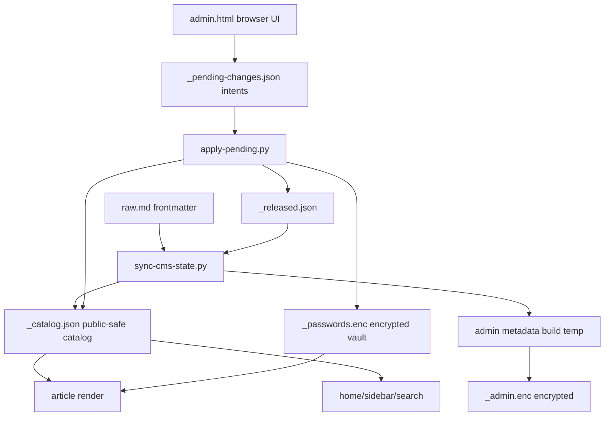

# Wikia Security Permissions Lane Discovery

## Executive Summary

This lane inspected the security and permission flows without reading private
source content, requesting secret values, or editing implementation code.

```text
private raw.md
   |
   v
sanitized catalog + encrypted admin metadata
   |
   +-- public navigation/search
   +-- gated article HTML
   +-- admin pending intent queue
   |
   v
apply/rebuild mutates vault + release/scope state
```

The current security posture is stronger than the earlier lane note suggested.
The main high-risk controls already exist in code and focused tests:

| Control | Current state |
| --- | --- |
| Gate plaintext temp cleanup | `gate.sh` uses `mktemp`, a cleanup trap, and no adjacent `.plaintext.tmp` output. |
| `scope=admin` pending injection | `apply-pending.py` rejects article scope changes outside `article`, `project`, or `bu`. |
| Public catalog admin-scope detection | `validate-state.sh` fails any public `_catalog.json` record with `scope=admin`. |
| Already-gated release cleanup | `strip-gate.py` removes stale gate wrapper, mount, gate CSS, and gate script. |
| Unlock persistence | `gate.html.tpl` uses BU-scoped `sessionStorage`, not `localStorage`. |

Remaining work is mostly contract hardening and reducing future drift, not
emergency patching.

## Files Inspected

| Area | Files |
| --- | --- |
| Vault and encryption | `/Users/felipegobbi/Documents/VibeworkV2/apps/wikia-worktrees/build-security-permissions/publisher/artifacts-publisher-source/scripts/vault.mjs`, `/Users/felipegobbi/Documents/VibeworkV2/apps/wikia-worktrees/build-security-permissions/publisher/artifacts-publisher-source/scripts/encrypt.mjs`, `/Users/felipegobbi/Documents/VibeworkV2/apps/wikia-worktrees/build-security-permissions/publisher/artifacts-publisher-source/scripts/encrypt-blob.mjs`, `/Users/felipegobbi/Documents/VibeworkV2/apps/wikia-worktrees/build-security-permissions/publisher/artifacts-publisher-source/scripts/extract-template.mjs` |
| Gate render/remove | `/Users/felipegobbi/Documents/VibeworkV2/apps/wikia-worktrees/build-security-permissions/publisher/artifacts-publisher-source/scripts/gate.sh`, `/Users/felipegobbi/Documents/VibeworkV2/apps/wikia-worktrees/build-security-permissions/publisher/artifacts-publisher-source/scripts/strip-gate.py`, `/Users/felipegobbi/Documents/VibeworkV2/apps/wikia-worktrees/build-security-permissions/publisher/artifacts-publisher-source/templates/gate.html.tpl` |
| Admin and pending intents | `/Users/felipegobbi/Documents/VibeworkV2/apps/wikia-worktrees/build-security-permissions/publisher/artifacts-publisher-source/templates/admin.html.tpl`, `/Users/felipegobbi/Documents/VibeworkV2/apps/wikia-worktrees/build-security-permissions/publisher/artifacts-publisher-source/templates/admin-decrypt.js`, `/Users/felipegobbi/Documents/VibeworkV2/apps/wikia-worktrees/build-security-permissions/publisher/artifacts-publisher-source/scripts/apply-pending.py`, `/Users/felipegobbi/Documents/VibeworkV2/apps/wikia-worktrees/build-security-permissions/publisher/artifacts-publisher-source/scripts/render-admin.py` |
| Permission catalog and validation | `/Users/felipegobbi/Documents/VibeworkV2/apps/wikia-worktrees/build-security-permissions/publisher/artifacts-publisher-source/scripts/public_catalog.py`, `/Users/felipegobbi/Documents/VibeworkV2/apps/wikia-worktrees/build-security-permissions/publisher/artifacts-publisher-source/scripts/sync-cms-state.py`, `/Users/felipegobbi/Documents/VibeworkV2/apps/wikia-worktrees/build-security-permissions/publisher/artifacts-publisher-source/scripts/admin-db.py`, `/Users/felipegobbi/Documents/VibeworkV2/apps/wikia-worktrees/build-security-permissions/publisher/artifacts-publisher-source/scripts/render-wiki.py`, `/Users/felipegobbi/Documents/VibeworkV2/apps/wikia-worktrees/build-security-permissions/publisher/artifacts-publisher-source/scripts/render-artifact.py`, `/Users/felipegobbi/Documents/VibeworkV2/apps/wikia-worktrees/build-security-permissions/publisher/artifacts-publisher-source/scripts/build-search-index.py`, `/Users/felipegobbi/Documents/VibeworkV2/apps/wikia-worktrees/build-security-permissions/publisher/artifacts-publisher-source/scripts/validate-state.sh` |
| Focused tests | `/Users/felipegobbi/Documents/VibeworkV2/apps/wikia-worktrees/build-security-permissions/publisher/artifacts-publisher-source/tests/test-security-permissions.sh`, `/Users/felipegobbi/Documents/VibeworkV2/apps/wikia-worktrees/build-security-permissions/publisher/artifacts-publisher-source/tests/test-gate-hardening.sh`, `/Users/felipegobbi/Documents/VibeworkV2/apps/wikia-worktrees/build-security-permissions/publisher/artifacts-publisher-source/tests/test-validate-state.sh`, `/Users/felipegobbi/Documents/VibeworkV2/apps/wikia-worktrees/build-security-permissions/publisher/artifacts-publisher-source/tests/test-publish-apply-pending.sh` |

## Permission Model Observed

Definitions:

| Term | Meaning |
| --- | --- |
| `gate_status` | Whether an article page should be public or encrypted. |
| `release_status` | Publishing lifecycle flag: unreleased, released, removed, etc. |
| `scope` | Navigation audience for a gated article after unlock: `article`, `project`, `bu`, or `public`. |
| `vault` | Encrypted password store in `_passwords.enc`. |
| `admin metadata` | Sanitized article metadata encrypted into `_admin.enc`. |
| `pending intents` | Browser-generated action queue in `_pending-changes.json`; server-side apply code performs real mutations. |



Public surfaces are supposed to expose only identity/routing/safe labels. Raw
article body, plaintext passwords, masterpass, private titles, and private tags
belong only in private source, temporary build state, or encrypted blobs.

## Ownership Map

| Concern | Owner file(s) | Current responsibility |
| --- | --- | --- |
| Password vault format | `vault.mjs`, `admin-decrypt.js` | AES-256-GCM with PBKDF2-SHA256, 100k iterations; Node writes, browser reads. |
| Article content gate | `gate.sh`, `extract-template.mjs`, `encrypt-blob.mjs`, `gate.html.tpl` | Extracts `<template id="ap-content-tpl">`, encrypts inner HTML, and injects browser unlock UI. |
| Legacy gate encryptor | `encrypt.mjs` | Still performs direct regex template extraction; not used by `gate.sh`. |
| Released article unwrap | `strip-gate.py` | Removes fresh template placeholder path and stale already-gated scaffolding. |
| Public metadata allowlist | `public_catalog.py`, `admin-db.py`, `sync-cms-state.py` | Builds sanitized catalog and admin state from raw frontmatter. |
| Sidebar/search visibility | `public_catalog.py`, `render-wiki.py`, `render-artifact.py`, `build-search-index.py` | Decides which records are visible on public pages and scoped gated pages. |
| Admin actions | `admin.html.tpl`, `apply-pending.py` | Browser creates intent queue; rebuild applies release/rotate/remove/scope changes server-side. |
| Validation | `validate-state.sh` and focused shell tests | Checks public output for plaintext raw files, secret-looking assignments, stale sidebar/search state, admin scope, and plaintext gate temp files. |

## Current Risks And Proposed Changes

| Priority | Risk | Why it matters | Proposed change |
| --- | --- | --- | --- |
| P1 | `encrypt.mjs` remains a direct-call footgun | It still uses a non-greedy regex against `<template id="ap-content-tpl">`, so direct invocation can truncate nested template content. `gate.sh` avoids it, but the file remains executable. | Make `encrypt.mjs` delegate to `extract-template.mjs` + `encrypt-blob.mjs`, or mark it deprecated and add a direct-invocation regression test. |
| P1 | Private slugs remain public-safe labels by policy, not by proof | `public_title()` falls back to a humanized slug for private records. A slug can reveal client, strategy, or launch hints even if title/body are hidden. | Lock the permission contract: either approve slug visibility as routing metadata or switch private locked labels to opaque copy such as `artigo protegido` outside unlocked scope. |
| P1 | Admin copy-paste commit script does not use `MAESTRO:` prefix | The script in `admin.html.tpl` stages only `_pending-changes.json`, which is good, but generated messages use `admin: ...`. That conflicts with the Auto Run convention for Maestro-managed commits. | If the admin script is for Maestro flows, generate `MAESTRO: admin ...`; if it is for human admins, document that it is outside Auto Run policy. |
| P2 | Vault CLI still permits plaintext masterpass as a positional argument | `apply-pending.py` rejects plaintext masterpass arguments, but `vault.mjs` still accepts them. This can leak through shell history or process listings if used manually. | Prefer env/stdin-only operation for sensitive automation and add docs/tests that discourage positional secret use. |
| P2 | Gate copy says one wiki password unlocks all articles in the session | Runtime storage is BU-scoped `sessionStorage`; article passwords still come from the vault per article. The text can mislead admins/users about actual scope. | Align gate UI copy with the real contract: session-only, BU-scoped remembered password attempt, article decrypt still depends on the matching password. |

## Previously Suspected Risks Now Covered

| Former concern | Evidence observed |
| --- | --- |
| Plaintext temp file left beside gated HTML | `gate.sh` now uses `mktemp` under `${TMPDIR:-/tmp}` plus `trap cleanup_plaintext EXIT HUP INT TERM`; tests force encryption failure and assert no temp residue. |
| Hand-edited `to_scope=admin` accepted | `public_catalog.PENDING_ARTICLE_SCOPE_TARGETS` excludes `admin`; `apply-pending.py` rejects anything outside `article`, `project`, `bu`. |
| Already-gated release keeps stale gate shell | `strip-gate.py` removes `.ap-gate-wrap`, `#ap-gate`, `#ap-content-mount`, gate CSS, and `#ap-gate-script`; tests cover this. |
| Unlock password persists after browser restart | `gate.html.tpl` uses `sessionStorage`; tests assert `localStorage` is not used by the gate template/output. |
| Validator duplicates permission logic | `validate-state.sh` imports `public_catalog` for `is_private_gate`, `is_public_record`, `record_key`, and `scoped_records`, reducing drift risk. |

## Proposed Permission Contract

Use this as input for [[Wikia Permission Contract Group Chat]] before changing
behavior that affects public visibility.

| Viewer state | Can see | Must not see |
| --- | --- | --- |
| Public visitor | Public/released article URLs, public titles, public tags, BU/project counts for public records only. | Private titles, private tags, private body, raw markdown, passwords, private cross-BU article list. |
| Visitor who unlocked one article | That article body and navigation records allowed by that article's `scope`. | Any record outside the declared scope; vault contents; admin metadata blob content. |
| Visitor who unlocked project scope | Private-safe labels and URLs inside the same BU/project, if contract allows slug visibility. | Other projects, other BUs, private body of sibling articles until their own password decrypts. |
| Visitor who unlocked BU scope | Private-safe labels and URLs inside the same BU, if contract allows slug visibility. | Other BUs, vault contents, admin-only metadata. |
| Admin with masterpass | Decrypted admin metadata and password vault in memory after unlock. | Plaintext secrets persisted into generated HTML/JSON or committed source. |

Suggested rule: reserve `admin` visibility for `/admin/` only, not for article
navigation or public catalog records.

## Focused Tests Run In This Discovery

| Command | Result |
| --- | --- |
| `bash publisher/artifacts-publisher-source/tests/test-security-permissions.sh` | PASS |
| `bash publisher/artifacts-publisher-source/tests/test-gate-hardening.sh` | PASS |
| `bash publisher/artifacts-publisher-source/tests/test-validate-state.sh` | PASS |
| `bash publisher/artifacts-publisher-source/tests/test-publish-apply-pending.sh` | PASS |

## Focused Tests To Run Later

| Test | Purpose | Suggested location |
| --- | --- | --- |
| Direct `encrypt.mjs` nested-template regression | Confirm direct invocation cannot truncate article content, or fail intentionally if the command is deprecated. | Extend `/Users/felipegobbi/Documents/VibeworkV2/apps/wikia-worktrees/build-security-permissions/publisher/artifacts-publisher-source/tests/test-gate-hardening.sh`. |
| Private slug leak fixture | Use a sensitive private slug and verify the final contract either allows that routing hint or replaces public labels with opaque locked text. | Extend `/Users/felipegobbi/Documents/VibeworkV2/apps/wikia-worktrees/build-security-permissions/publisher/artifacts-publisher-source/tests/test-publish-private-source.sh`. |
| Vault CLI secret-handling regression | Verify sensitive automation paths use env/stdin and never require plaintext masterpass positional arguments. | Extend `/Users/felipegobbi/Documents/VibeworkV2/apps/wikia-worktrees/build-security-permissions/publisher/artifacts-publisher-source/tests/test-vault-mjs.sh`. |
| Admin commit-message convention test | Verify generated admin copy-paste script either uses `MAESTRO:` or is explicitly documented as human-admin-only. | Extend `/Users/felipegobbi/Documents/VibeworkV2/apps/wikia-worktrees/build-security-permissions/publisher/artifacts-publisher-source/tests/test-admin-scoped-pending-intents.sh` after updating its fixture path. |

## Notes For Next Lane

Do not implement permission behavior changes until the slug visibility contract
is decided in `/Users/felipegobbi/Documents/VibeworkV2/apps/wikia-worktrees/build-security-permissions/.maestro/group-chat-prompts/wikia-permission-contract.md`.

No private source files were read. No secret values were requested, printed, or
stored in this note. Images analyzed: 0.
