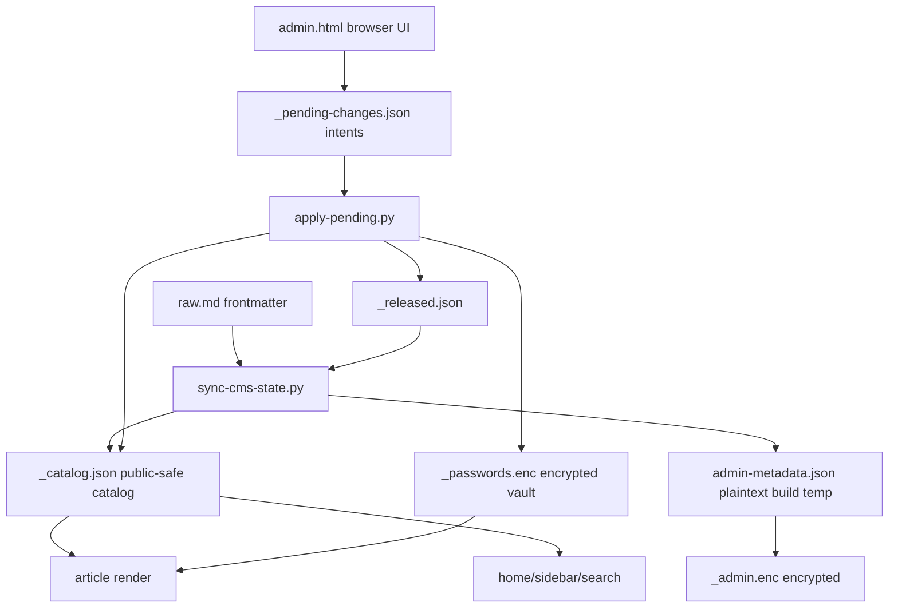

# Wikia Security Permissions Lane Discovery

## Executive Summary

This lane inspected the security and permission flows without reading private
source content, requesting secrets, or changing implementation code.

```text
private raw.md
   |
   v
sanitized catalog + encrypted admin metadata
   |
   +-- public navigation/search
   +-- gated article HTML
   +-- admin pending intent queue
   |
   v
apply/rebuild mutates vault + release/scope state
```

The current model is directionally sound: public surfaces are driven from
`_catalog.json`, admin metadata is encrypted into `_admin.enc`, article
passwords live in `_passwords.enc`, and browser admin actions create pending
intents instead of mutating the vault directly.

Highest-priority concerns for the build lane:

1. `gate.sh` writes a plaintext temporary file next to the output HTML and does
   not use a cleanup trap, so a failed encryption step can leave extracted
   article HTML in public output.
2. `scope=admin` is allowed by backend state helpers and by
   `apply-pending.py`, even though the browser UI only exposes article/project/BU
   scope. If a pending file is hand-edited, one gated article can expose the
   full catalog in its navigation surface.
3. `strip-gate.py` says it removes an already-gated wrapper, but the defensive
   path currently removes only the gate script. A released page rebuilt from
   already-gated HTML can retain stale gate UI.
4. Permission logic is duplicated between `public_catalog.py` and
   `validate-state.sh`, which creates drift risk when the permission contract
   changes.

## Files Inspected

| Area | Files |
| --- | --- |
| Vault and encryption | `/Users/felipegobbi/Documents/VibeworkV2/apps/wikia-worktrees/build-security-permissions/publisher/artifacts-publisher-source/scripts/vault.mjs`, `/Users/felipegobbi/Documents/VibeworkV2/apps/wikia-worktrees/build-security-permissions/publisher/artifacts-publisher-source/scripts/encrypt.mjs`, `/Users/felipegobbi/Documents/VibeworkV2/apps/wikia-worktrees/build-security-permissions/publisher/artifacts-publisher-source/scripts/encrypt-blob.mjs`, `/Users/felipegobbi/Documents/VibeworkV2/apps/wikia-worktrees/build-security-permissions/publisher/artifacts-publisher-source/scripts/extract-template.mjs` |
| Gate render/remove | `/Users/felipegobbi/Documents/VibeworkV2/apps/wikia-worktrees/build-security-permissions/publisher/artifacts-publisher-source/scripts/gate.sh`, `/Users/felipegobbi/Documents/VibeworkV2/apps/wikia-worktrees/build-security-permissions/publisher/artifacts-publisher-source/scripts/strip-gate.py`, `/Users/felipegobbi/Documents/VibeworkV2/apps/wikia-worktrees/build-security-permissions/publisher/artifacts-publisher-source/templates/gate.html.tpl` |
| Admin and pending intents | `/Users/felipegobbi/Documents/VibeworkV2/apps/wikia-worktrees/build-security-permissions/publisher/artifacts-publisher-source/templates/admin.html.tpl`, `/Users/felipegobbi/Documents/VibeworkV2/apps/wikia-worktrees/build-security-permissions/publisher/artifacts-publisher-source/templates/admin-decrypt.js`, `/Users/felipegobbi/Documents/VibeworkV2/apps/wikia-worktrees/build-security-permissions/publisher/artifacts-publisher-source/scripts/apply-pending.py`, `/Users/felipegobbi/Documents/VibeworkV2/apps/wikia-worktrees/build-security-permissions/publisher/artifacts-publisher-source/scripts/render-admin.py` |
| Permission catalog | `/Users/felipegobbi/Documents/VibeworkV2/apps/wikia-worktrees/build-security-permissions/publisher/artifacts-publisher-source/scripts/public_catalog.py`, `/Users/felipegobbi/Documents/VibeworkV2/apps/wikia-worktrees/build-security-permissions/publisher/artifacts-publisher-source/scripts/sync-cms-state.py`, `/Users/felipegobbi/Documents/VibeworkV2/apps/wikia-worktrees/build-security-permissions/publisher/artifacts-publisher-source/scripts/admin-db.py`, `/Users/felipegobbi/Documents/VibeworkV2/apps/wikia-worktrees/build-security-permissions/publisher/artifacts-publisher-source/scripts/render-wiki.py`, `/Users/felipegobbi/Documents/VibeworkV2/apps/wikia-worktrees/build-security-permissions/publisher/artifacts-publisher-source/scripts/render-artifact.py`, `/Users/felipegobbi/Documents/VibeworkV2/apps/wikia-worktrees/build-security-permissions/publisher/artifacts-publisher-source/scripts/build-search-index.py`, `/Users/felipegobbi/Documents/VibeworkV2/apps/wikia-worktrees/build-security-permissions/publisher/artifacts-publisher-source/scripts/validate-state.sh` |

## Permission Model Observed

Definitions:

| Term | Meaning |
| --- | --- |
| `gate_status` | Whether an article page should be public or encrypted. |
| `release_status` | Publishing lifecycle flag: unreleased, released, removed, etc. |
| `scope` | The size of the audience shown in navigation after unlock: article, project, BU, admin, or public. |
| `vault` | Encrypted password store in `_passwords.enc`. |
| `admin metadata` | Sanitized article metadata encrypted into `_admin.enc`. |



Public surfaces are supposed to expose only identity/routing/safe labels. Raw
article body, plaintext passwords, masterpass, private titles, and private tags
belong only in private source, temporary build state, or encrypted blobs.

## Ownership Map

| Concern | Owner file(s) | Current responsibility |
| --- | --- | --- |
| Password vault format | `vault.mjs`, `admin-decrypt.js` | AES-256-GCM with PBKDF2-SHA256, 100k iterations; Node writes, browser reads. |
| Article content gate | `gate.sh`, `extract-template.mjs`, `encrypt-blob.mjs`, `gate.html.tpl` | Extracts `<template id="ap-content-tpl">`, encrypts inner HTML, injects browser unlock UI. |
| Released article unwrap | `strip-gate.py` | Removes template/gate scaffolding and inlines content for public pages. |
| Public metadata allowlist | `public_catalog.py`, `admin-db.py`, `sync-cms-state.py` | Builds sanitized catalog and admin state from raw frontmatter. |
| Sidebar/search visibility | `public_catalog.py`, `render-wiki.py`, `render-artifact.py`, `build-search-index.py` | Decides which records are visible on public pages and scoped gated pages. |
| Admin actions | `admin.html.tpl`, `apply-pending.py` | Browser creates intent queue; rebuild applies release/rotate/remove/scope changes server-side. |
| Validation | `validate-state.sh` and existing tests | Checks public output for plaintext raw files, secret-looking assignments, sidebar drift, and search/catalog mismatch. |

## Key Risks

| Priority | Risk | Why it matters | Proposed change |
| --- | --- | --- | --- |
| P0 | Plaintext temp file in gate pipeline | `gate.sh` writes `${HTML_FILE}.plaintext.tmp` in the same public output directory. If extraction succeeds but encryption or replacement fails, plaintext HTML can remain under `docs/gitpages`. | Use `mktemp` outside public output where possible and add `trap 'rm -f "$PLAINTEXT_FILE"' EXIT` before extraction. Add validation that no `*.plaintext.tmp` exists under public root. |
| P0 | `scope=admin` can be injected through pending JSON | `public_catalog.scoped_records()` returns all records for `scope == "admin"`, and `apply-pending.py` accepts `admin` as a target scope. Browser UI does not expose this, but the pending file is copy-paste editable. | For article records, reject pending `to_scope=admin` unless a separate admin-only surface is being built. Add validation that public artifact records never ship with `scope=admin`. |
| P1 | Released pages can retain stale gate wrapper | `strip-gate.py` documentation says it removes the wrapper in already-gated mode, but current code removes only `<script id="ap-gate-script">`. | Extend already-gated stripping to remove `.ap-gate-wrap`/`#ap-gate` wrapper and embedded gate CSS, then test both fresh-rendered and already-gated inputs. |
| P1 | Duplicated permission logic can drift | `public_catalog.py` and `validate-state.sh` both define `is_public_record()` and `scoped_records()`. If one changes and the other does not, tests can approve the wrong contract. | Make validation import the shared helper or generate expected visibility through one shared module. |
| P1 | Private slug can become a public hint | For hidden records, `public_title()` falls back to a humanized slug. That is safer than raw title, but slugs may still reveal sensitive strategy/client names. | Lock the permission contract: decide whether private slugs are allowed metadata. If not, use opaque labels like `artigo protegido` outside unlocked admin scope. |
| P1 | Browser stores plaintext unlock password in `localStorage` by BU | A password survives browser restarts and any script running on the same origin can read it. BU isolation limits cross-BU reuse but not same-BU persistence. | Prefer `sessionStorage` or an explicit "remember on this browser" toggle with a clear logout action. |
| P2 | Legacy `encrypt.mjs` remains footgun | It still uses a non-greedy regex and mutates HTML directly. `gate.sh` now uses the safer `extract-template.mjs` + `encrypt-blob.mjs` path, but direct invocation can reintroduce truncation. | Either make `encrypt.mjs` call the fixed extractor or mark it deprecated and add a failing test for nested templates if called directly. |
| P2 | Admin copy-paste script commits without Maestro prefix | The generated admin script uses `git add docs/gitpages/_pending-changes.json` and `git commit -m 'admin: ...'`. This is explicit staging, but it does not follow the lane's `MAESTRO:` commit convention. | If this admin script is meant for Maestro runs, align the generated commit message with the required prefix; otherwise document it as a human admin workflow. |

## Proposed Permission Contract

Use this as input for [[Wikia Permission Contract Group Chat]] before code
changes.

| Viewer state | Can see | Must not see |
| --- | --- | --- |
| Public visitor | Public/released article URLs, public titles, public tags, BU/project counts for public records only. | Private titles, private tags, private body, raw markdown, passwords, private cross-BU article list. |
| Visitor who unlocked one article | That article body and navigation records allowed by that article's `scope`. | Any record outside the declared scope; vault contents; admin metadata blob content. |
| Visitor who unlocked project scope | Private-safe labels and URLs inside the same BU/project, if contract allows slug visibility. | Other projects, other BUs, private body of sibling articles until their own password decrypts. |
| Visitor who unlocked BU scope | Private-safe labels and URLs inside the same BU, if contract allows slug visibility. | Other BUs, vault contents, admin-only metadata. |
| Admin with masterpass | Decrypted admin metadata and password vault in memory after unlock. | Plaintext secrets persisted into generated HTML/JSON or committed source. |

Suggested rule: reserve `scope=admin` for `/admin/` only, not for article pages.

## Focused Tests To Run Later

| Test | Purpose | Suggested location |
| --- | --- | --- |
| Gate temp cleanup failure test | Force `encrypt-blob.mjs` to fail after extraction and assert no plaintext temp file remains under public output. | Add to `/Users/felipegobbi/Documents/VibeworkV2/apps/wikia-worktrees/build-security-permissions/publisher/artifacts-publisher-source/tests/test-publish-validation.sh` or a new gate-focused test. |
| Reject article `scope=admin` | Feed `_pending-changes.json` with `to_scope: "admin"` and assert `apply-pending.py` rejects it or validation fails before publish. | Extend `/Users/felipegobbi/Documents/VibeworkV2/apps/wikia-worktrees/build-security-permissions/publisher/artifacts-publisher-source/tests/test-publish-apply-pending.sh`. |
| Strip already-gated release page | Build an already-gated HTML fixture, run `strip-gate.py`, and assert no `ap-gate`, encrypted payload, or gate wrapper remains. | New test near `/Users/felipegobbi/Documents/VibeworkV2/apps/wikia-worktrees/build-security-permissions/publisher/artifacts-publisher-source/tests/test-validate-state.sh`. |
| Scope visibility matrix | Verify public/article/project/BU scopes produce exactly the expected sidebar URLs. | Extend `/Users/felipegobbi/Documents/VibeworkV2/apps/wikia-worktrees/build-security-permissions/publisher/artifacts-publisher-source/tests/test-validate-state.sh`. |
| Private slug/title leak check | Use a private raw title and revealing slug; assert public pages/search do not expose forbidden labels under the final contract. | New public catalog/render smoke test. |
| Vault/admin crypto round-trip | Confirm `vault.mjs` and `admin-decrypt.js` can read the same encrypted payload without printing secret values in logs. | Extend `/Users/felipegobbi/Documents/VibeworkV2/apps/wikia-worktrees/build-security-permissions/publisher/artifacts-publisher-source/tests/test-vault-mjs.sh` or add a browser decrypt fixture. |

## Notes For Next Lane

Do not implement security changes without first locking the permission contract
in `/Users/felipegobbi/Documents/VibeworkV2/apps/wikia-worktrees/build-security-permissions/.maestro/group-chat-prompts/wikia-permission-contract.md`.

No private source files were read. No secret values were requested, printed, or
stored in this note.
